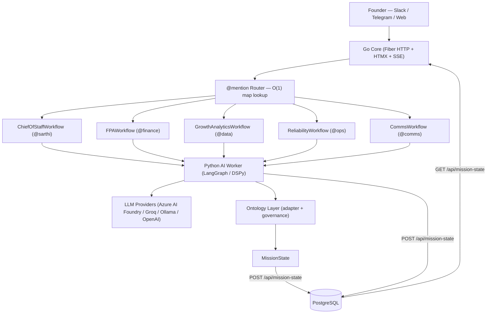
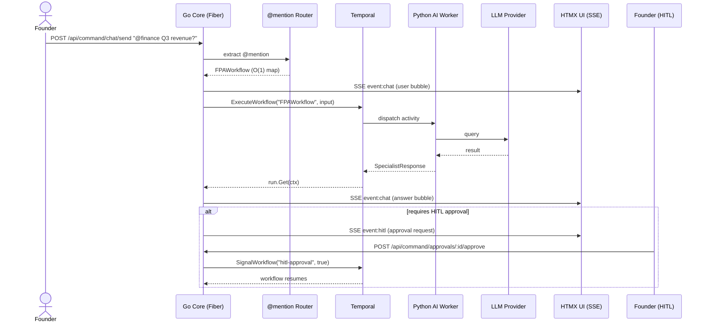

# OntologyAI

> **A ChatOps platform where founders chat with specialist AI agents.** OntologyAI builds a live, governed *Ontology* of a small business from its existing tools — and lets domain specialists (FP&A, Growth, Reliability, Comms, Chief of Staff) query and act on it, with every consequential action gated by human approval.

[](#getting-started)
[](#test-coverage)
[](https://go.dev)
[](https://www.python.org)

---

## Table of Contents

- [What problem does it solve?](#what-problem-does-it-solve)
- [Feature Highlights](#feature-highlights)
- [Architecture](#architecture)
- [Request / Response Flow](#request--response-flow)
- [Ontology Layer](#ontology-layer)
- [Project Structure](#project-structure)
- [Getting Started](#getting-started)
- [Architecture Decision Records](#architecture-decision-records)
- [History / Migration](#history--migration)
- [Contributing & Conventions](#contributing--conventions)

---

## What problem does it solve?

Founders live in a dozen disconnected tools (Stripe, HubSpot, Slack, incident trackers) and a flood of dashboards they never open. **OntologyAI collapses that into a single chat surface:**

- You type `@finance What's our burn this month?` and a domain specialist answers — grounded in your real business state.
- Every specialist reads from and writes through one shared, typed **Ontology** (customers, deals, revenue, incidents, messages, planned actions).
- Any action with real-world blast radius (cancel a subscription, send a customer message, change an incident severity) is **blocked behind human approval** — nothing consequential happens silently.

The result: signal-to-action in seconds, with guardrails that scale from copilot to semi-autonomous operator.

---

## Feature Highlights

- **Five canonical specialist agents** — chat `@mention` routing maps aliases to `ChiefOfStaff`, `FPA`, `GrowthAnalytics`, `Reliability`, and `Comms` workflows via an O(1) map lookup.
- **V4.2 Ontology layer** — 6 strict Pydantic v2 Object Types + a `LINK_TYPES` registry, with a tolerant `MissionState → Ontology` adapter.
- **Governed writes** — a `@governed_write` blast-radius gate (`OBJECT_WRITE_POLICY`) routes consequential mutations through a `PlannedAction` that requires human approval.
- **Human-in-the-loop (HITL)** — Temporal signals (`SignalWorkflow("hitl-approval")`) unblock `AwaitWithTimeout` gates so approval buttons actually drive workflow execution.
- **Real-time streaming** — HTMX `hx-ext="sse"` + Fiber `SetBodyStreamWriter`, with an `SSEHub` that does per-subscriber, event-type-filtered fan-out.
- **MissionState write path** — the Python AI worker persists operational state via `POST /api/mission-state` → PostgreSQL, which the Go dashboard renders server-side.
- **Authority manifest** — 5 agents declare role, permissions, and tool allowlists; the trust battery and alert gate enforce boundaries.

---

## Architecture

Founders reach OntologyAI through chat (Slack / Telegram / Web). The Go Core accepts the message, routes the `@mention` in O(1), and dispatches a Temporal workflow. A Python AI worker runs the LangGraph/DSPy agent against an LLM provider, streams the answer back over SSE, and — for consequential writes — proposes a `PlannedAction` that a human approves.



**Key components**

| Layer | Responsibility |
|-------|----------------|
| **Go Core** (`apps/core/`) | Fiber HTTP server, HTMX templates, SSE streaming, `@mention` routing, Temporal client. |
| **Temporal** | Orchestrates the 5 canonical specialist workflows; hosts HITL `AwaitWithTimeout` gates. |
| **Python AI Worker** (`apps/ai/`) | LangGraph/DSPy agents per domain; builds the Ontology; proposes governed writes. |
| **LLM providers** | OpenAI-compatible SDK → Azure AI Foundry, Groq, Ollama, OpenAI (auto-detected). |
| **PostgreSQL** | MissionState store; the dashboard's single source of truth. |
| **Qdrant + Graphiti** | Vector/semantic memory for agents. |

---

## Request / Response Flow

A typical `@mention` query — from the founder's message to a streamed answer, with the optional HITL approval branch:



The dispatch runs in a goroutine with a 5-minute context timeout and a non-blocking `tryBroadcast()` (`select { case ch <- msg: default: log }`) so the UI shows a "🤔 Thinking…" bubble immediately and never blocks the HTTP handler.

---

## Ontology Layer

The V4.2 Ontology is a **schema/semantic extension** on top of `MissionState` and PostgreSQL — not a rewrite. It is fully implemented and TDD-verified (**42 tests passing**: 23 schema + 12 adapter + 7 governance).

| Component | File | What it does |
|-----------|------|--------------|
| **Object Types** | `apps/ai/src/ontology/object_types.py` | 6 strict Pydantic v2 models (`extra="forbid"`, `strict=True`): `Customer`, `Deal`, `RevenueMetric`, `Incident`, `Message`, `PlannedAction`. |
| **Link Types** | `apps/ai/src/ontology/link_types.py` | `LINK_TYPES` registry of 4 semantic links + `resolve_link()` (raises `KeyError` for unknown links). |
| **MissionState → Ontology Adapter** | `apps/ai/src/ontology/adapter.py` | `mission_state_to_ontology(state) -> dict[str, list[BaseModel]]` — tolerant per-field mapping of a `MissionState` payload into typed ontology buckets. |
| **Governed Writes** | `apps/ai/src/ontology/governance.py` | `@governed_write` decorator enforcing the `OBJECT_WRITE_POLICY` blast-radius gate; emits a `PlannedAction` and blocks above threshold. Reference wrappers: `governed_fpa_cancel`, `governed_growth_flag`, `governed_reliability_incident_update`, `governed_comms_send`. |

### Object Types & Links

```mermaid
classDiagram
    class Customer {
        +str id
        +str name
        +float mrr
        +float health_score
        +datetime last_contact_at
    }
    class Deal {
        +str id
        +str stage
        +float value
        +float close_probability
        +str owner
    }
    class RevenueMetric {
        +str period
        +float mrr
        +float burn
        +int runway_days
    }
    class Incident {
        +str id
        +str severity
        +datetime opened_at
        +datetime resolved_at
        +str root_cause
    }
    class Message {
        +str id
        +str channel
        +str thread_id
        +str sentiment
        +str drafted_by
    }
    class PlannedAction {
        +str id
        +str type
        +Literal blast_radius
        +str status
        +str requested_by
    }
    Incident "many" --> "many" Customer : incident_affects_customer
    Deal "many" --> "one" Customer : deal_belongs_to_customer
    Message "many" --> "one" Deal : message_relates_to_deal
    PlannedAction "many" --> "*" : action_targets_object
```

### `mission_state_to_ontology`

`mission_state_to_ontology(state)` normalizes a flat `MissionState` dict (or any object dumpable to a dict) into six typed lists — one per Object Type. It is **tolerant**: unknown/legacy keys are ignored, invalid items are skipped, and a `RevenueMetric` can be *derived* from flat finance scalars (`mrr`, `burn`, `runway_days`) when no explicit list is supplied. The input is never mutated and the function never raises on partial payloads.

### `@governed_write`

The `@governed_write` decorator enforces human-in-the-loop approval for consequential ontology writes. Two independent gates trigger a required `PlannedAction`:

1. **Explicit flag** — the property is `requires_approval=True` in `OBJECT_WRITE_POLICY`.
2. **Blast-radius threshold** — the effective blast radius is at/above the configured threshold (default `"medium"`; `"low"` writes proceed).

When a `PlannedAction` is required, the decorator **blocks** the underlying write and returns the `PlannedAction` for the caller to submit for approval — mirroring the Temporal `AwaitWithTimeout` HITL pattern used elsewhere in the system. If no `PlannedAction` can be produced, it raises `GovernanceError`.

```python
@governed_write(object_type="Customer", property_name="mrr", requested_by="FP&A")
def governed_fpa_cancel(customer_id: str, reason: str, **kwargs): ...
```

---

## Project Structure

```
apps/
  core/                     # Go Modular Monolith
    cmd/
      server/               # HTTP server entrypoint
      worker/               # Temporal worker entrypoint
      consumer/             # Event consumer entrypoint
    internal/
      web/                  # HTTP handlers (Fiber + HTMX + SSE)
        handler.go          # All endpoints, @mention routing (O(1) map, 10 aliases → 5 workflows)
        sse.go              # SSE handler (SetBodyStreamWriter + SSEHub)
        command_center_test.go
        templates/
          command_center.html
          partials/         # HTMX partials (chat, approvals, mission-state, ...)
      agents/               # Go agent definitions
      config/               # LLM configuration
      db/                   # sqlc generated code
      database/             # Connection utilities
      temporal/             # Temporal client (SignalWorkflow, ExecuteWorkflow)
      workflow/             # Temporal workflows & stubs
    sqlc.yaml               # sqlc configuration
  ai/                       # Python AI Worker
    src/
      ontology/             # V4.2 — Object Types, Link Types, Adapter, Governance
      agents/               # Agent definitions (base, finance, data, ops, comms, ...)
      workflows/            # Temporal workflow definitions
        chief_of_staff_workflow.py   # @workflow.defn(name="ChiefOfStaffWorkflow")
        fpa_workflow.py              # @workflow.defn(name="FPAWorkflow")
        growth_analytics_workflow.py # @workflow.defn(name="GrowthAnalyticsWorkflow")
        reliability_workflow.py      # @workflow.defn(name="ReliabilityWorkflow")
        comms_workflow.py            # @workflow.defn(name="CommsWorkflow")
        qa_workflow.py               # Backward-compat → ChiefOfStaffWorkflow
        finance_workflow.py          # Backward-compat → FPAWorkflow
        data_workflow.py             # Backward-compat → GrowthAnalyticsWorkflow
        ops_workflow.py              # Backward-compat → ReliabilityWorkflow
      schemas/              # Pydantic models (SpecialistResponse, guardian, ...)
      session/              # MissionState, relevance gate
      guardian/             # Watchlist, detector, assemblers
      memory/               # Graphiti, Qdrant, spine
      integrations/         # Stripe, Plaid, Slack, ERPNext, HubSpot, QuickBooks
      services/             # Trust battery, alert gate
      worker.py             # Registers all workflows + activities
    tests/                  # Pytest suite (901 passing / 26 skipped)
    pyproject.toml          # Python dependencies
```

---

## Getting Started

### Prerequisites

- **Docker** (Temporal, Qdrant, PostgreSQL)
- **Go 1.24**
- **Python 3.13** with [`uv`](https://github.com/astral-sh/uv)

### Quickstart

```bash
# 1. Start infrastructure (Temporal, Qdrant, PostgreSQL)
make up

# 2. Run the Go server (HTTP + HTMX + SSE)
cd apps/core && go run cmd/server/main.go

# 3. Run the Go Temporal worker (in a second terminal)
cd apps/core && go run cmd/worker/main.go

# 4. Install Python deps and run the Python Temporal worker (third terminal)
cd apps/ai && uv sync
cd apps/ai && uv run python -m src.worker

# 5. Open the command center
#    http://localhost:8080/command
#    Type "@finance What's my current burn?" → see "🤔 Thinking..." → see the answer
```

### Run the tests

```bash
# Go — all packages
cd apps/core && go test ./...

# Go — web handlers only
cd apps/core && go test ./internal/web/... -v

# Python — full suite (901 passing / 26 skipped)
cd apps/ai && uv run pytest tests/ -v

# Python — ontology TDD suites (42 tests)
cd apps/ai && uv run pytest tests/test_ontology_schema.py tests/test_ontology_adapter.py tests/test_ontology_governance.py -v
```

### Environment variables (LLM providers)

The system uses the official OpenAI-compatible SDK, auto-detecting the configured provider:

| Provider | Variables |
|----------|-----------|
| **Azure AI Foundry** | `AZURE_OPENAI_ENDPOINT`, `AZURE_OPENAI_API_KEY` |
| **Groq** | `GROQ_API_KEY` |
| **OpenAI** | `OPENAI_API_KEY` |
| **Ollama** (local) | `OLLAMA_BASE_URL`, `OLLAMA_API_KEY` |

Secrets live in a local `.env` file (never committed). See `internal/config/llm.go` for auto-detection logic.

---

## Architecture Decision Records

These ADRs capture the load-bearing architectural decisions. Each follows an RFC 2119-style **Status / Context / Decision / Consequences** structure.

### ADR-001: Rebrand TrackGuard / Sarthi → OntologyAI

- **Status:** Accepted
- **Context:** The product was known as *TrackGuard* / *Sarthi*. As the scope expanded from alert-tracking to a full business Ontology with governed specialist agents, the old name no longer reflected the product. A rebrand risked breaking existing deployments, chat aliases, migration filenames, and Docker/container names that external tooling depended on.
- **Decision:** Rebrand the product to **OntologyAI** across all user-facing surfaces (page titles, display names, documentation). To preserve compatibility we **MUST** keep:
  - the `@sarthi` chat alias (and `@agent`, `@qa`, `@ask`) routing to `ChiefOfStaffWorkflow`;
  - SQL migration filenames and Docker service/container names (e.g. `iterateswarm-api`);
  - the Temporal task queue constant `TRACKGUARD-MAIN-QUEUE`.
  Internal Pydantic `Sarthi*` types were fully renamed to `OntologyAI*` with zero dangling references.
- **Consequences:**
  - *Positive:* A name that matches the product's actual scope; clean, consistent branding for newcomers.
  - *Negative:* Two names coexist in the codebase (product = OntologyAI; some infra identifiers retain the legacy name), which must be documented to avoid confusion (see [History / Migration](#history--migration)).

### ADR-002: Five frozen canonical specialist workflows with O(1) `@mention` map routing

- **Status:** Accepted
- **Context:** Earlier versions used a growing `if/else if` chain for `@mention` routing, and a 6-specialist roster that included Hiring. Adding a specialist required editing routing code, and the chain was O(n). The roster needed to be frozen to a stable, well-understood set.
- **Decision:** Freeze **five** canonical workflows — `ChiefOfStaffWorkflow`, `FPAWorkflow`, `GrowthAnalyticsWorkflow`, `ReliabilityWorkflow`, `CommsWorkflow` — and replace the `if/else` chain with a declarative `map[string]specialistRoute` providing O(1) lookup. Adding a specialist is now **one map entry + one Python workflow class**; no handler changes. The Hiring specialist was removed from the canonical set.
- **Consequences:**
  - *Positive:* O(1) routing; new specialists are data-driven; the roster is stable and documented.
  - *Negative:* Workflow type strings are not compile-time checked — a typo fails at runtime. Mitigated by a test that verifies every route's workflow name matches a registered Temporal workflow.

### ADR-003: Governed-write blast-radius gate for ontology mutations

- **Status:** Accepted
- **Context:** Specialists can propose writes with real-world impact (cancel a subscription, change an incident severity, send a customer message). Unbounded autonomous writes are unsafe for a founder-facing product. The system already used Temporal `AwaitWithTimeout` HITL gates for planned actions; ontology mutations needed the same guarantee at the data layer.
- **Decision:** Introduce `@governed_write` plus an `OBJECT_WRITE_POLICY` registry. A write is blocked and routed through a `PlannedAction` (requiring human approval) when either (a) the property is `requires_approval=True`, or (b) its effective blast radius is at/above a configurable threshold (default `"medium"`; `"low"` writes proceed). The decorator mirrors the Temporal HITL pattern: it returns the `PlannedAction` and intentionally does **not** execute the underlying write. Four reference wrappers demonstrate the contract per specialist (`governed_fpa_cancel`, `governed_growth_flag`, `governed_reliability_incident_update`, `governed_comms_send`).
- **Consequences:**
  - *Positive:* Consequential writes are never silent; a single, overridable policy source governs blast radius; the contract is unit-testable in isolation.
  - *Negative:* Every governed write adds a round-trip (propose → approve → execute); the policy source must be kept in sync with the actual specialist actions.

### ADR-004: SSE + HTMX `SetBodyStreamWriter` for streaming chat

- **Status:** Accepted
- **Context:** The original client used raw JavaScript `EventSource` with client-side DOM construction for every chat bubble — duplicating template logic and adding ~40 lines of reconnect/parse JS. Synchronous `run.Get()` in the HTTP handler also blocked responses for up to 60s.
- **Decision:** Stream chat over Server-Sent Events using Fiber's `SetBodyStreamWriter` with a `*bufio.Writer`, and let HTMX's `hx-ext="sse"` manage the connection lifecycle declaratively (`sse-connect` / `sse-swap` / `hx-swap`). The server renders chat bubbles as HTML fragments (`renderChatBubble()`) and pushes them as named SSE events (`event: chat`); all user/LLM text is `html.EscapeString()`-escaped. An `SSEHub` provides event-type-filtered, per-subscriber fan-out (buffered 64).
- **Consequences:**
  - *Positive:* ~40 fewer lines of JS; auto-reconnect built in; single source of truth for HTML; XSS-safe; immediate "Thinking…" feedback via non-blocking `tryBroadcast()`.
  - *Negative:* HTML fragments over SSE inflate bandwidth vs JSON; harder to integrate non-HTMX clients; error handling moves into goroutine closures (log-based monitoring required).

---

## History / Migration

> The product was rebranded to **OntologyAI**. The notes below record what changed so the old names are not mistaken for current branding.

- **Branding:** "TrackGuard" / "Sarthi" → "OntologyAI" across all page titles, display names, and documentation.
- **Chat alias preserved:** `@sarthi` still routes to `ChiefOfStaffWorkflow` for backward compatibility (along with `@agent`, `@qa`, `@ask`).
- **Schema types renamed:** internal Pydantic `Sarthi*` types renamed to `OntologyAI*` — complete rename, zero dangling `Sarthi` references in code.
- **Not renamed (backward compat):** SQL migration filenames (e.g. `008_sarthi_internal_ops.sql`) and Docker service/container names (e.g. `iterateswarm-api`) keep their names. The Temporal task queue constant **`TRACKGUARD-MAIN-QUEUE`** is also retained.
- **Specialist roster:** 6 specialists → 5 canonical specialists (Hiring removed).
- **Workflow renames:** `QAWorkflow` → `ChiefOfStaffWorkflow`, `FinanceWorkflow` → `FPAWorkflow`, `DataWorkflow` → `GrowthAnalyticsWorkflow`, `OpsWorkflow` → `ReliabilityWorkflow`. Backward-compat re-exports (`qa_workflow.py`, `finance_workflow.py`, `data_workflow.py`, `ops_workflow.py`) are preserved with deprecation warnings.
- **API endpoints:** `GET /api/mission-state` and `POST /api/mission-state` added for Python AI ↔ Go Core integration.

---

## Contributing & Conventions

- **Feature branches:** `git checkout -b feature/description` — never commit directly to `main`.
- **Conventional Commits:** `feat:`, `fix:`, `refactor:`, `docs:`, `test:`, `chore:`.
- **Never commit to `main`.** Open a PR from your feature branch.
- **Secrets:** use a local `.env` file; never commit secrets.
- **Agent guidelines:** full coding standards, build/test commands, and the specialist route-map pattern live in [`AGENTS.md`](./AGENTS.md) at the repo root.
- **Database:** use `sqlc` for type-safe SQL; regenerate generated code after schema changes.

---

## Test Coverage

| Suite | Tests | Status |
|-------|-------|--------|
| Python Unit Tests | 901 passing / 26 skipped / 0 failed | ✅ |
| Ontology TDD (schema + adapter + governance) | 42 (23 + 12 + 7) | ✅ |
| Go HTMX Web Handlers | 74+ | ✅ |
| Go Build | Clean | ✅ Binary compiles |
| E2E Smoke Test | 9/9 | ✅ Real Docker + real LLM |
| DB Tests | — | 🟡 Skip (requires PostgreSQL container) |
