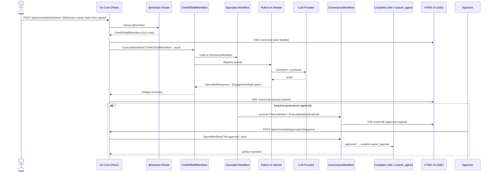
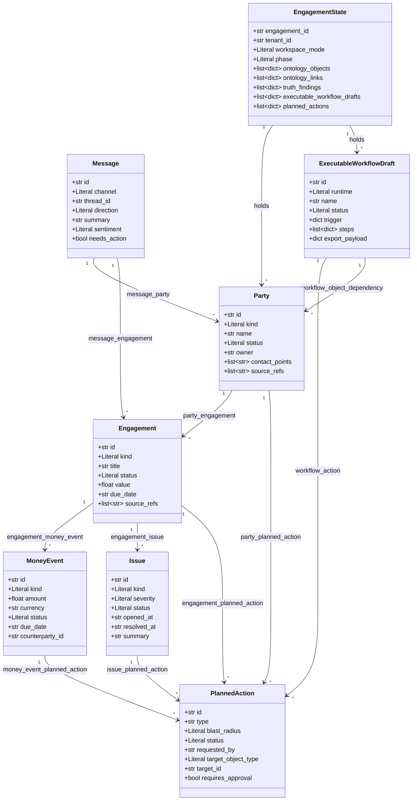

# OntologyAI

> **A self-serve FDE companion and multi-agent Forward Deployed Engineer operating system.** OntologyAI turns messy business operations into a shared, governed *Ontology* — then diagnoses truth across people, money, work, messages, and decisions, generates governed workflow specs, and compiles executable automation drafts for n8n or custom-agent runtimes. It runs in two modes: an FDE-assisted workspace and a client self-serve workspace.

[](#getting-started)
[](#test-coverage)
[](https://go.dev)
[](https://www.python.org)
[](#history--migration)

---

## Table of Contents

- [What is OntologyAI?](#what-is-ontologyai)
- [Feature Highlights](#feature-highlights)
- [Architecture](#architecture)
- [Request / Response Flow](#request--response-flow)
- [Ontology Layer](#ontology-layer)
- [Project Structure](#project-structure)
- [Getting Started](#getting-started)
- [Architecture Decision Records](#architecture-decision-records)
- [History / Migration](#history--migration)
- [Contributing & Conventions](#contributing--conventions)

---

## What is OntologyAI?

OntologyAI V5.1 is a **self-serve FDE companion** and **multi-agent Forward Deployed Engineer (FDE) operating system**. It converts messy business inputs — chat, uploads, transcripts, exports, and connected systems — into shared operational truth, then generates governed workflow designs and, where viable, executable automation drafts.

It operates in two engagement modes:

| Mode | Who drives it | Use |
|------|---------------|-----|
| `fde_assisted` | A real FDE / operator | Compresses discovery → ontology mapping → truth analysis → workflow design → governance → pilot deployment. |
| `client_self_serve` | A client via a workspace link | Converses with the system, uploads files, connects tools, and answers targeted follow-up questions; the agents run the same discovery-to-workflow loop. |

Both modes share one ontology, one workflow engine, one governance layer, and one artifact-generation system. The only difference is who drives the interaction.

The 7 engagement phases are first-class workflow states:

`discovery` → `ontology_mapping` → `truth_analysis` → `workflow_design` → `governance_review` → `deployment_planning` → `handoff`

The result: a portfolio-grade simulation of how an FDE actually works — a shared agentic workspace that produces deployable outputs (truth maps, workflow packs, SOP packs, action registers, executable drafts), not just chat responses.

---

## Feature Highlights

- **7 canonical workflows** — `ChiefOfStaffWorkflow` (control-plane orchestrator) plus 6 specialists: `DiscoveryWorkflow`, `OntologyMappingWorkflow`, `TruthAnalysisWorkflow`, `WorkflowBuilderWorkflow`, `GovernanceWorkflow`, `StrategyWorkflow`. Routed via an O(1) `@mention` map.
- **V5.1 Ontology layer** — 6 strict Pydantic v2 Object Types (`Party`, `Engagement`, `MoneyEvent`, `Issue`, `Message`, `PlannedAction`) + `ExecutableWorkflowDraft` + `EngagementState`, with an 11-entry `LINK_TYPES` registry and a tolerant adapter.
- **Governance exclusivity** — only `GovernanceWorkflow` may finalize external execution or set `status=activated/exported`. Medium/high blast-radius actions require approval. `@governed_write` enforces this at the data layer.
- **Deterministic runtime compilers** — `n8n`, `windmill`, `adk_go`, `pydantic_ai`, and `python_agent` (`smolagents`) compilers produce the `export_payload` from an `ExecutableWorkflowDraft`. The LLM never writes the payload; deterministic code handles routing, validation, thresholds, and formatting (thin-LLM / fat-deterministic-core). A `RuntimeCompiler` ABC with a `get_compiler()` factory routes compilation by runtime name. **Windmill** (ADR-009) is the primary target; n8n is preserved as legacy backward compat.
- **Exportable artifacts** — truth map, ontology snapshot, workflow pack, SOP pack, action register, and executable workflow draft, all generated as inspectable, exportable JSONB.
- **Human-in-the-loop (HITL)** — Temporal signals (`SignalWorkflow("hitl-approval")`) unblock `AwaitWithTimeout` gates so approval buttons actually drive workflow execution.
- **Real-time streaming** — HTMX `hx-ext="sse"` + Fiber `SetBodyStreamWriter`, with an `SSEHub` that does per-subscriber, event-type-filtered fan-out.
- **Canonical shared state** — `EngagementState` is the single source of truth; every specialist reads it first and writes back a typed, deterministically-merged patch. `mission_states` remains a read-only bridge for one version.
- **V6 BABOK Strategy Analysis** — `StrategyWorkflow` produces 5 versioned BA artifacts (`CurrentStateDescription`, `BusinessObjectives`, `RiskAnalysisResults`, `ChangeStrategy`, `SolutionEvaluationReport`) from discovery + truth outputs. Artifacts are immutable after approval (`frozen=True`); `new_version()` creates versioned copies.
- **GovernanceGate** — Thin pre-execution gate checking approval status, blast-radius threshold, and actor authorization. Blocks execution unless both `ChangeStrategy` and `PlannedAction` are approved.
- **Solution Evaluation** — `SolutionEvaluationReport` captures expected vs actual outcomes, metrics, limitations, and recommended actions — closing the BABOK loop.

---

## Architecture

Users reach OntologyAI through a shared agentic workspace (web). The Go Core accepts the message, routes the `@mention` in O(1) to the `ChiefOfStaffWorkflow` control plane, which dispatches specialist Temporal workflows. A Python AI worker runs the LangGraph/DSPy agents against an LLM provider, streams answers back over SSE, and — for consequential writes — proposes a `PlannedAction` that `GovernanceWorkflow` approves. Approved `ExecutableWorkflowDraft`s are compiled deterministically (Windmill / n8n / ADK-Go / PydanticAI / smolagents) and exported behind the governance gate. **V6 BABOK** adds a `StrategyWorkflow` that produces 5 versioned BA artifacts from discovery + truth outputs, a `GovernanceGate` for pre-execution policy checks, and a `SolutionEvaluationReport` to close the evaluation loop.

```mermaid
flowchart TD
    U["Founder / Client (2 modes: fde_assisted, client_self_serve)"] --> CORE["Go Core (Fiber HTTP + HTMX + SSE)"]
    CORE --> ROUTER["@mention Router — O(1) map lookup → ChiefOfStaff control plane"]
    ROUTER --> COS["ChiefOfStaffWorkflow  (@ontologyai / @chief / @sarthi)"]
    COS --> DISC["DiscoveryWorkflow  (@discover)"]
    COS --> MAP["OntologyMappingWorkflow  (@map)"]
    COS --> TRUTH["TruthAnalysisWorkflow  (@truth)"]
    COS --> BUILD["WorkflowBuilderWorkflow  (@build)"]
    COS --> STRAT["StrategyWorkflow  (@strategy) <br/> <i>V6 BABOK</i>"]
    COS --> GOV["GovernanceWorkflow  (@govern)"]
    DISC --> PY["Python AI Worker (LangGraph / DSPy)"]
    MAP --> PY
    TRUTH --> PY
    STRAT --> PY
    BUILD --> PY
    GOV --> PY
    PY --> LLM["LLM Providers (Azure AI Foundry / Groq / Ollama / OpenAI)"]
    PY --> ONTO["Ontology Layer (adapter + governance + EngagementState)"]
    ONTO --> PG[("PostgreSQL (engagement_states)")]
    ONTO -->|"read-only bridge"| MS[("mission_states")]
    ONTO --> REDIS[("Redis")]
    ONTO --> QDRANT[("Qdrant")]
    ONTO --> GRAPH[("Neo4j + Graphiti)"]

    STRAT -->|"CurrentStateDescription"| ARTIFACTS["V6 BA Artifacts"]
    STRAT -->|"BusinessObjectives"| ARTIFACTS
    STRAT -->|"RiskAnalysisResults"| ARTIFACTS
    STRAT -->|"ChangeStrategy"| ARTIFACTS
    STRAT -->|"SolutionEvaluationReport"| ARTIFACTS

    BUILD -->|"ExecutableWorkflowDraft"| GOV
    GOV -->|"approved"| GATE["GovernanceGate <br/> <i>V6 BABOK</i>"]
    GATE -->|"check: approved + blast-radius + actor"| COMP["Deterministic Compilers <br/> (Windmill / n8n / ADK-Go / PydanticAI / smolagents)"]
    COMP -->|"export_payload"| EXPORT["Artifact Exports (governance-gated)"]
    GOV -->|"audit + observability"| OBS["Langfuse / Audit Logs"]

    subgraph OWNED["OntologyAI-owned (built, not bought)"]
        CANVAS["OntologyAI Workflow Canvas (simplified n8n-like node editor)"]
        MODEL["Canonical Model: ExecutableWorkflowDraft (12-node vocabulary)"]
        WS["Shared Client + FDE Workspace (chat, transcript, evidence, governance)"]
    end
    CANVAS --> MODEL
    WS --> CANVAS

    subgraph RUNTIME["Runtime Targets (execution only)"]
        WM["Windmill <br/> <i>primary (ADR-009)</i>"]
        N8N["n8n <br/> <i>legacy compat</i>"]
        ADK["ADK-Go"]
        PA["PydanticAI"]
        SA["smolagents"]
    end
    COMP -->|"Windmill script/flow"| WM
    COMP -->|"n8n JSON"| N8N
    COMP -->|"main.go / tools.go"| ADK
    COMP -->|"agent.py"| PA
    COMP -->|"worker.py"| SA
    WM -.->|"run state / errors (read-only)"| WS
    N8N -.->|"run state / errors (read-only)"| WS
    PA -.->|"run state (read-only)"| WS
```

**Key components**

| Layer | Responsibility |
|-------|----------------|
| **Interface** (`apps/core/` HTMX) | Web workspace, chat, uploads, approval UI, exports UI (11 screens). |
| **OntologyAI Workflow Canvas** (owned) | Simplified n8n-like node editor; every edit persisted to `ExecutableWorkflowDraft`. Native n8n editor is **not** exposed to clients (OEM/Embed license). |
| **Canonical model** (owned) | `ExecutableWorkflowDraft` + 12-node vocabulary — the AI-authored, governed, versioned source of truth. |
| **Go Core** (`apps/core/`) | Fiber HTTP server, HTMX templates, SSE streaming, `@mention` routing, Temporal client. |
| **Control plane** | `ChiefOfStaffWorkflow` — intent classify, route, deterministically merge `EngagementState` patches, summarize. |
| **Specialist workflow layer** | 6 Temporal workflows: Discovery, Ontology Mapping, Truth Analysis, Workflow Builder, Strategy, Governance. |
| **Python AI Worker** (`apps/ai/`) | LangGraph/DSPy agents per domain; builds the Ontology; proposes governed writes; compiles drafts. Backbone = Temporal + typed Python; ADK optional; smolagents sandboxed-only. Compilers: `RuntimeCompiler` ABC + 4 targets (n8n, ADK-Go, PydanticAI, smolagents). |
| **LLM providers** | OpenAI-compatible SDK → Azure AI Foundry, Groq, Ollama, OpenAI (auto-detected). |
| **Data & memory** | PostgreSQL (`engagement_states`), Redis, Qdrant, Neo4j + Graphiti. |
| **BABOK Strategy (V6)** | `StrategyWorkflow` produces 5 versioned BA artifacts from truth findings + operator goal. Artifacts are immutable after approval; `GovernanceGate` checks approval, blast-radius, and authorization before execution. `SolutionEvaluationReport` closes the evaluation loop. |
| **Runtime / export** | 5 deterministic compilers (`windmill`, `n8n`, `adk_go`, `pydantic_ai`, `python_agent`) behind a `RuntimeCompiler` ABC + `get_compiler()` factory, all gated by `GovernanceWorkflow` + `GovernanceGate`. **Windmill** (ADR-009) is the primary target; n8n is legacy backward compat. |
| **Observability** | Langfuse tracing, audit logs, approval history. |

---

## Request / Response Flow

A typical `@mention` query — from the user's message to a streamed answer, with the specialist → governance approval → deterministic export branch:



The dispatch runs in a goroutine with a 5-minute context timeout and a non-blocking `tryBroadcast()` (`select { case ch <- msg: default: log }`) so the UI shows a "🤔 Thinking…" bubble immediately and never blocks the HTTP handler.

---

## Ontology Layer

The V5.1 Ontology is the **canonical shared model** of a business engagement. It is fully typed (Pydantic v2, `extra="forbid"`, `strict=True`) and TDD-verified. It comprises 6 primary Object Types, the `ExecutableWorkflowDraft` and `EngagementState` shared-state shapes, and 11 semantic link types.

| Component | File | What it does |
|-----------|------|--------------|
| **Object Types** | `apps/ai/src/ontology/object_types.py` | 6 strict Pydantic v2 models: `Party`, `Engagement`, `MoneyEvent`, `Issue`, `Message`, `PlannedAction`. |
| **Link Types** | `apps/ai/src/ontology/link_types.py` | `LINK_TYPES` registry of 11 semantic links + `resolve_link()`. |
| **Action Types** | `apps/ai/src/ontology/action_types.py` | Full `PlannedAction` model + action registry. |
| **Workflow Drafts** | `apps/ai/src/ontology/workflow_drafts.py` | `ExecutableWorkflowDraft` — single source of truth; `export_payload` only set by compiler; `status="activated"` only by Governance. |
| **Engagement State** | `apps/ai/src/schemas/engagement_state.py` | `EngagementState` canonical shared state (mode, phase, ontology objects/links, truth findings, drafts, actions). |
| **Governed Writes** | `apps/ai/src/ontology/governance.py` | `@governed_write` decorator enforcing the `OBJECT_WRITE_POLICY` blast-radius gate; only `GovernanceWorkflow` finalizes external execution. |

### Object Types, Links & Shared State



### `@governed_write`

The `@governed_write` decorator enforces human-in-the-loop approval for consequential ontology writes. Two independent gates trigger a required `PlannedAction`:

1. **Explicit flag** — the property is `requires_approval=True` in `OBJECT_WRITE_POLICY`.
2. **Blast-radius threshold** — the effective blast radius is at/above the configured threshold (default `"medium"`; `"low"` writes proceed).

When a `PlannedAction` is required, the decorator **blocks** the underlying write and returns the `PlannedAction` for the caller to submit for approval. Only `GovernanceWorkflow` may set `status=activated`, `executing`, `completed`, or `exported` on external side effects.

```python
@governed_write(object_type="Party", property_name="status", requested_by="Discovery")
def governed_party_update(party_id: str, **kwargs): ...
```

---

## Project Structure

```
apps/
  core/                     # Go Modular Monolith (control / gateway)
    cmd/
      server/               # HTTP server entrypoint
      worker/               # Temporal worker entrypoint
    internal/
      web/                  # HTTP handlers (Fiber + HTMX + SSE)
        handler.go          # All endpoints, @mention routing (O(1) map → 17 aliases / 7 workflows)
        sse.go              # SSE handler (SetBodyStreamWriter + SSEHub)
        command_center_test.go
        templates/
          command_center.html
          partials/         # HTMX partials (11 workspace screens)
      agents/               # Go agent definitions
      config/               # LLM configuration
      db/                   # sqlc generated code
      database/             # Connection utilities
      temporal/             # Temporal client (SignalWorkflow, ExecuteWorkflow)
      workflow/             # Temporal workflows & stubs
    sqlc.yaml               # sqlc configuration
  ai/                       # Python AI Worker
    src/
      ontology/             # V5.1 — Object Types, Link Types, Action Types, Workflow Drafts, Governance
        object_types.py     # 6 canonical types
        link_types.py       # 11 link types
        action_types.py     # PlannedAction + registry
        workflow_drafts.py  # ExecutableWorkflowDraft (source of truth)
        adapter.py          # mission_state_to_ontology (read-only bridge)
        governance.py       # @governed_write + OBJECT_WRITE_POLICY
      schemas/              # Pydantic models (engagement_state, specialist_response, workflow_spec, sop, executable_workflow_draft)
      schemas/              # Pydantic models + V6 BABOK artifacts
        ba_artifact.py          # BaseArtifact + ArtifactLifecycleStatus (V6)
        strategy_artifacts.py   # 5 BABOK artifacts: CurrentStateDescription, BusinessObjectives, RiskAnalysisResults, ChangeStrategy, SolutionEvaluationReport (V6)
        governance_gate.py      # GovernanceGate — approval + blast-radius + actor checks (V6)
      workflows/            # Temporal workflow definitions (+ V6 StrategyWorkflow)
        chief_of_staff_workflow.py   # @workflow.defn(name="ChiefOfStaffWorkflow")
        discovery_workflow.py        # @workflow.defn(name="DiscoveryWorkflow")
        ontology_mapping_workflow.py # @workflow.defn(name="OntologyMappingWorkflow")
        truth_analysis_workflow.py   # @workflow.defn(name="TruthAnalysisWorkflow")
        workflow_builder_workflow.py # @workflow.defn(name="WorkflowBuilderWorkflow")
        governance_workflow.py       # @workflow.defn(name="GovernanceWorkflow")
        strategy_workflow.py         # @workflow.defn(name="StrategyWorkflow") (V6)
      runtime/              # Deterministic compilers (5 targets) + artifact export
        base.py                 # RuntimeCompiler ABC
        windmill_compiler.py    # Windmill script/flow compiler (primary, ADR-009)
        windmill_client.py      # Windmill REST API client
        n8n_compiler.py         # n8n JSON compiler (legacy compat)
        n8n.py                  # N8NCompiler wrapper class
        n8n_client.py           # n8n REST API client
        adk_go_compiler.py      # ADK-Go: generates main.go + tools.go
        pydantic_ai_compiler.py # PydanticAI: generates agent.py w/ BaseModel
        python_agent_compiler.py# smolagents: generates CodeAgent worker.py
        custom_agent_compiler.py# Legacy agent config compiler
        deployers.py            # Deployer functions (windmill, n8n, custom_agent)
        artifact_export.py      # Artifact export service
      session/              # EngagementState store (canonical) + mission_state read bridge
      memory/               # Graphiti, Qdrant, spine
      integrations/         # Stripe, Plaid, Slack, ERPNext, HubSpot, QuickBooks
      services/             # Trust battery, alert gate
      worker.py             # Registers the 7 workflows + activities
    tests/                  # Pytest suite (901 passing / 26 skipped + V5.1 suites)
    pyproject.toml          # Python dependencies
```

---

## Getting Started

### Prerequisites

- **Docker** (Temporal, Qdrant, PostgreSQL, Neo4j)
- **Go 1.24**
- **Python 3.13** with [`uv`](https://github.com/astral-sh/uv)

### Quickstart

```bash
# 1. Start infrastructure (Temporal, Qdrant, PostgreSQL, Neo4j)
make up

# 2. Run the Go server (HTTP + HTMX + SSE workspace)
cd apps/core && go run cmd/server/main.go

# 3. Run the Go Temporal worker (in a second terminal)
cd apps/core && go run cmd/worker/main.go

# 4. Install Python deps and run the Python Temporal worker (third terminal)
cd apps/ai && uv sync
cd apps/ai && uv run python -m src.worker

# 5. Open the workspace
#    http://localhost:8080/command
#    Type "@discover Extract the key facts from this upload" → see "🤔 Thinking..." → see the answer
```

### Run the tests

```bash
# Go — all packages
cd apps/core && go test ./...

# Go — web handlers only
cd apps/core && go test ./internal/web/... -v

# Python — full suite (901 passing / 26 skipped + V5.1 schema/workflow/compiler/governance/export + multi-runtime suites)
cd apps/ai && uv run pytest tests/ -v

# Python — ontology TDD suites
cd apps/ai && uv run pytest tests/test_ontology_schema.py tests/test_link_and_action_registry.py tests/test_engagement_state.py tests/test_executable_workflow_draft.py -v
```

### Environment variables (LLM providers + legacy modules)

The system uses the official OpenAI-compatible SDK, auto-detecting the configured provider:

| Provider | Variables |
|----------|-----------|
| **Azure AI Foundry** | `AZURE_OPENAI_ENDPOINT`, `AZURE_OPENAI_API_KEY` |
| **Groq** | `GROQ_API_KEY` |
| **OpenAI** | `OPENAI_API_KEY` |
| **Ollama** (local) | `OLLAMA_BASE_URL`, `OLLAMA_API_KEY` |

| Control | Variable | Default |
|---------|----------|---------|
| Temporal task queue | `ONTOLOGYAI-MAIN-QUEUE` (fallback `TRACKGUARD-MAIN-QUEUE`) | `TRACKGUARD-MAIN-QUEUE` |
| Legacy FDE modules | `LEGACY_FDE_MODULES=on` | off (gated) |

Secrets live in a local `.env` file (never committed). See `internal/config/llm.go` for auto-detection logic.

---

## Architecture Decision Records

These ADRs capture the load-bearing architectural decisions. Each follows an RFC 2119-style **Status / Context / Decision / Consequences** structure.

### ADR-001: Rebrand TrackGuard / Sarthi → OntologyAI

- **Status:** Accepted
- **Context:** The product was known as *TrackGuard* / *Sarthi*. As the scope expanded from alert-tracking to a full business Ontology with governed specialist agents, the old name no longer reflected the product. A rebrand risked breaking existing deployments, chat aliases, migration filenames, and Docker/container names that external tooling depended on.
- **Decision:** Rebrand the product to **OntologyAI** across all user-facing surfaces (page titles, display names, documentation). To preserve compatibility we **MUST** keep:
  - the `@sarthi` chat alias (and `@agent`, `@qa`, `@ask`) routing to `ChiefOfStaffWorkflow`;
  - SQL migration filenames and Docker service/container names (e.g. `iterateswarm-api`);
  - the Temporal task queue constant `TRACKGUARD-MAIN-QUEUE` (now the fallback default for `ONTOLOGYAI-MAIN-QUEUE`).
  Internal Pydantic `Sarthi*` types were fully renamed to `OntologyAI*` with zero dangling references.
- **Consequences:**
  - *Positive:* A name that matches the product's actual scope; clean, consistent branding for newcomers.
  - *Negative:* Two names coexist in the codebase (product = OntologyAI; some infra identifiers retain the legacy name), which must be documented to avoid confusion (see [History / Migration](#history--migration)).

### ADR-002: Six frozen canonical workflows with O(1) `@mention` map routing

- **Status:** Accepted
- **Context:** V4.2 froze a 5-specialist roster (`ChiefOfStaffWorkflow`, `FPAWorkflow`, `GrowthAnalyticsWorkflow`, `ReliabilityWorkflow`, `CommsWorkflow`) with O(1) map routing. V5.1 reframes the product as a self-serve FDE companion + multi-agent FDE operating system, replacing the domain-specialist roster with a discovery-to-deployment workflow roster.
- **Decision:** Freeze **six** canonical workflows — `ChiefOfStaffWorkflow` (control-plane orchestrator), `DiscoveryWorkflow`, `OntologyMappingWorkflow`, `TruthAnalysisWorkflow`, `WorkflowBuilderWorkflow`, `GovernanceWorkflow` — and keep the declarative `map[string]specialistRoute` providing O(1) lookup. The control-plane alias set (`@ontologyai`, `@agent`, `@ask`, `@chief`, `@sarthi`) routes to `ChiefOfStaffWorkflow`; specialist aliases (`@discover`, `@map`, `@truth`, `@build`, `@govern`) route to the five specialists. Adding a workflow is now **one map entry + one Python workflow class**; no handler changes.
- **Consequences:**
  - *Positive:* O(1) routing; new workflows are data-driven; the roster is stable and documented; the control plane cleanly separates orchestration from domain work.
  - *Negative:* Workflow type strings are not compile-time checked — a typo fails at runtime. Mitigated by a test that verifies every route's workflow name matches a registered Temporal workflow.

### ADR-003: Governance exclusivity — only `GovernanceWorkflow` finalizes external execution

- **Status:** Accepted
- **Context:** Specialists can propose writes with real-world impact (change money state, send a message, activate a workflow). Unbounded autonomous writes are unsafe for a founder/client-facing product. V4.2 introduced `@governed_write` routing consequential mutations through a `PlannedAction`; V5.1 extends this so that *no* workflow except `GovernanceWorkflow` may set `status=activated`, `executing`, `completed`, or `exported` on external side effects.
- **Decision:** Keep `@governed_write` plus an `OBJECT_WRITE_POLICY` registry. A write is blocked and routed through a `PlannedAction` (requiring human approval) when either (a) the property is `requires_approval=True`, or (b) its effective blast radius is at/above a configurable threshold (default `"medium"`; `"low"` writes proceed). Additionally, `GovernanceWorkflow` is the sole executor of final external side effects; `ExecutableWorkflowDraft.status="activated"` may only be set by `GovernanceWorkflow`. The decorator mirrors the Temporal HITL pattern: it returns the `PlannedAction` and intentionally does **not** execute the underlying write.
- **Consequences:**
  - *Positive:* Consequential writes are never silent; a single, overridable policy source governs blast radius; governance is the single gate before any side effect; the contract is unit-testable in isolation.
  - *Negative:* Every governed write adds a round-trip (propose → approve → execute); the policy source must be kept in sync with the actual specialist actions.

### ADR-004: Deterministic compiler / export purity rule

- **Status:** Accepted
- **Context:** V5.1 must generate deployable `ExecutableWorkflowDraft` artifacts for n8n and custom-agent runtimes. Letting the LLM freehand the export payload risks malformed, unvalidated, or unsafe automation. The thin-LLM / fat-deterministic-core principle forbids the LLM from generating export payloads directly.
- **Decision:** All compilers (n8n, ADK-Go, PydanticAI, smolagents) are **pure, deterministic functions** extending a `RuntimeCompiler` ABC with a `compile(draft: dict) -> dict` contract. The LLM may propose workflow *structure* (steps, decision points, approvals) but **must never write `export_payload`**. `export_payload` is only populated by the compiler code; this is enforced by a model validator in `workflow_drafts.py` and asserted in `test_runtime_compilers.py` / `test_n8n_compiler.py`.
- **Consequences:**
  - *Positive:* Byte-stable, validated, inspectable exports; the LLM is kept in its safe lane (ambiguity, synthesis, narrative); exports are reproducible and testable.
  - *Negative:* Compiler logic must be maintained for each runtime target; structure proposed by the LLM must be normalized by the compiler before export.

### ADR-005: `EngagementState` as canonical shared state (with `mission_states` read-only bridge)

- **Status:** Accepted
- **Context:** V4.2 used `MissionState` as the operational state store. V5.1 needs a richer, phase-aware shared state (`EngagementState`) covering discovery notes, ontology objects/links, truth findings, workflow specs, executable drafts, and planned actions — with `workspace_mode` and `phase` as first-class fields. Deleting `mission_states` outright would break the existing read path and downstream consumers.
- **Decision:** Make `EngagementState` the **canonical write target** (persisted in `engagement_states`). Keep `mission_states` as a **read-only bridge for one version**; `mission_state_to_ontology` remains callable until the adapter is fully migrated to `MoneyEvent`. All specialist workflows read `EngagementState` first and write back a typed, deterministically-merged patch; unknown keys are rejected and merge conflicts log + preserve provenance. `workspace_mode` is immutable after creation unless explicitly migrated.
- **Consequences:**
  - *Positive:* One shared, typed source of truth; no agent owns a private model of the business; clean migration path without breaking existing infra.
  - *Negative:* Two state shapes coexist for one version; the bridge adds a small maintenance burden until `mission_states` is retired.

### ADR-006: SSE + HTMX `SetBodyStreamWriter` for streaming chat

- **Status:** Accepted
- **Context:** The original client used raw JavaScript `EventSource` with client-side DOM construction for every chat bubble — duplicating template logic and adding ~40 lines of reconnect/parse JS. Synchronous `run.Get()` in the HTTP handler also blocked responses for up to 60s.
- **Decision:** Stream chat over Server-Sent Events using Fiber's `SetBodyStreamWriter` with a `*bufio.Writer`, and let HTMX's `hx-ext="sse"` manage the connection lifecycle declaratively (`sse-connect` / `sse-swap` / `hx-swap`). The server renders chat bubbles as HTML fragments (`renderChatBubble()`) and pushes them as named SSE events (`event: chat`); all user/LLM text is `html.EscapeString()`-escaped. An `SSEHub` provides event-type-filtered, per-subscriber fan-out (buffered 64).
- **Consequences:**
  - *Positive:* ~40 fewer lines of JS; auto-reconnect built in; single source of truth for HTML; XSS-safe; immediate "Thinking…" feedback via non-blocking `tryBroadcast()`.
   - *Negative:* HTML fragments over SSE inflate bandwidth vs JSON; harder to integrate non-HTMX clients; error handling moves into goroutine closures (log-based monitoring required).

### ADR-007: Reuse n8n as the invisible execution runtime; build the OntologyAI canvas on the canonical model

- **Status:** Accepted (locked V5.1, PR #33, branch `feature/ontologyai-v5.1`)
- **Context:** V5.1 already ships the canonical `ExecutableWorkflowDraft` model, deterministic compilers (`runtime/n8n_compiler.py`, `runtime/custom_agent_compiler.py`, `runtime/artifact_export.py`), 6 active workflows, and `EngagementState` with deterministic `merge_patch`. The open question was whether to build a workflow engine/canvas from scratch or reuse an existing one. Building from scratch would duplicate mature execution/integration/retry/scheduling/credential tooling and slow "finishing the product."
- **Decision:** **Do NOT build the workflow engine or canvas from scratch.** Reuse **n8n** as the execution/runtime layer, but build **OntologyAI's own client-facing AI workspace and live workflow canvas** on top of the canonical `ExecutableWorkflowDraft` model. The final split:

  | Layer | Decision | Why |
  |-------|----------|-----|
  | Client experience | Build your own | Differentiation: conversation, transcript extraction, evidence, AI suggestions, FDE collaboration, governance, pilot creation |
  | Workflow data model | Build your own typed canonical model | Lets the AI generate/validate/explain/version/govern workflows deterministically |
  | Execution runtime | Reuse n8n first | n8n provides execution, integrations, retries, scheduling, credentials, ops tooling |
  | Agent orchestration | Keep existing Temporal/Python | 6 workflow roles, typed shared state, governance, deterministic compilers already exist |
  | Agent framework | Use one, not two | Do not add ADK merely because fashionable; smolagents only sandboxed utility |

  **Licensing constraint:** the native n8n editor is **NOT** exposed to clients in the first release (n8n OEM/Embed license required). The OntologyAI canvas *looks and behaves like* a simplified n8n canvas; every edit is saved into `ExecutableWorkflowDraft`; approved drafts compile to n8n JSON and deploy to the client's own n8n instance or a managed n8n runtime only after the appropriate commercial agreement. Run state, errors, and activation status are reflected back into OntologyAI read-only.

  **Stack ownership:** OntologyAI owns the workspace, ingestion, evidence, ontology/truth generation, canvas, governance UI, versioning, and the compile/export button. n8n owns execution, connectors, scheduling/retries, and credential handling on the client instance. Python owns extraction, retrieval, validation, deterministic compilation, policy/approval gates, agent coordination, and audit trail.

  **Multi-runtime compilers (ADR-008):** Four deterministic compilers now exist behind a `RuntimeCompiler` ABC: n8n (automation), ADK-Go (Go-native agents), PydanticAI (typed Python agents), and smolagents/python_agent (sandboxed utility). Runtime selection is deterministic based on workflow traits. See [`ADR-008`](#architecture-decision-records).

  **ADK vs smolagents:** Temporal + typed Python = backbone; ADK = optional orchestration enhancement only (not added merely because fashionable); smolagents = sandboxed utility worker (document exploration, safe data transforms, connector research, isolated code analysis) — agent-generated code must NOT access production network, credentials, database, or the n8n instance.

  **Canonical node vocabulary (12 nodes):** Trigger, Human input/form, AI extraction or classification, Condition/branch, HTTP/API action, Send message, Create/update record, Approval gate, Delay/schedule, Transform data, Error/fallback, End/success metric. These map to n8n during compilation; new integrations/bespoke nodes come later.
- **Consequences:**
  - *Positive:* No duplicated execution engine; fast path to a finished product; clear differentiation in the client experience; deterministic, governed, versioned workflow authoring; n8n's ops tooling reused for free.
   - *Negative:* A license boundary must be respected (no exposed n8n editor in first release); the OntologyAI canvas must stay in sync with `ExecutableWorkflowDraft`; deployment to a managed n8n runtime is gated on a commercial agreement.

### ADR-008: Multi-Runtime Compiler Architecture

- **Status:** Accepted
- **Context:** V5.1 originally shipped two deterministic compilers (`n8n`, `custom_agent`). As three agent-runtime patterns emerged (typed Python, Go-native, sandboxed utility), a single monolith compiler became untenable. The product director confirmed LangGraph + OntologyAI stays the single control plane.
- **Decision:** Create a `RuntimeCompiler` ABC with a `get_compiler()` factory. Four deterministic compilers each produce a runtime-specific artifact from the canonical `ExecutableWorkflowDraft`: n8n (JSON), ADK-Go (Go source), PydanticAI (Python agent), smolagents (sandboxed worker). Runtime selection is deterministic based on workflow traits.
- **Consequences:**
  - *Positive:* Each compiler is isolated, testable, and swappable without changing the product brain.
  - *Positive:* 15 TDD tests cover all 4 targets + ABC + factory — byte-stable, reproducible exports.
  - *Negative:* Each new runtime target requires a new compiler module; generated code must be reviewed by client teams.

### ADR-009: Windmill replaces n8n as primary execution runtime

- **Status:** Accepted
- **Context:** n8n served as the execution runtime throughout V5.1 development. As the product scaled, Windmill emerged as a better fit: natively supports Python/TypeScript scripts, has a built-in approval/suspend module, supports secret management, webhooks, schedules, and is open-source with a permissive AGPL license. Windmill's script/flow model maps directly to `ExecutableWorkflowDraft` without an intermediate compilation step (scripts are first-class).
- **Decision:** Replace n8n with **Windmill** as the canonical execution target (ADR-009). n8n is preserved as legacy backward compat but is no longer the primary target. Windmill runs on port 8000 with a dedicated worker container.
- **Consequences:**
  - *Positive:* Native script/flow support, built-in approvals, secrets, webhooks, AGPL license.
  - *Negative:* Windmill Docker image must be pulled and configured; `WINDMILL_TOKEN` must be set in `.env`.

### V5.1/V6 Runtime: Windmill (primary) + n8n (legacy compat)

Windmill runs as the primary execution runtime with its REST API exposed on port `8000`:

```
http://windmill:8000/api
```

n8n is preserved for backward compatibility on the internal `iterateswarm-net` network:

```
http://n8n:5678/api/v1
```

- Windmill credentials: `WINDMILL_URL`, `WINDMILL_TOKEN`, `WINDMILL_WORKER_TOKEN` in `.env`.
- n8n credentials: `N8N_API_KEY` (legacy, will be deprecated).
- The OntologyAI canvas is the only client-facing surface; Windmill/n8n editors are never exposed.

---

## History / Migration

> The product was rebranded to **OntologyAI**. The notes below record what changed so the old names are not mistaken for current branding.

- **Branding:** "TrackGuard" / "Sarthi" → "OntologyAI" across all page titles, display names, and documentation.
- **Chat alias preserved:** `@sarthi` still routes to `ChiefOfStaffWorkflow` for backward compatibility (along with `@agent`, `@qa`, `@ask`, `@chief`). Specialist aliases: `@discover`, `@map`, `@truth`, `@build`, `@govern`, `@strategy`.
- **Schema types renamed:** internal Pydantic `Sarthi*` types renamed to `OntologyAI*` — complete rename, zero dangling `Sarthi` references in code.
- **Not renamed (backward compat):** SQL migration filenames (e.g. `008_sarthi_internal_ops.sql`) and Docker service/container names (e.g. `iterateswarm-api`) keep their names. The Temporal task queue constant **`TRACKGUARD-MAIN-QUEUE`** is retained as the fallback default for `ONTOLOGYAI-MAIN-QUEUE`.
- **V4.2 → V5.1 → V6:** the 5-specialist roster is **replaced** by the 7-workflow FDE roster (`ChiefOfStaffWorkflow`, `DiscoveryWorkflow`, `OntologyMappingWorkflow`, `TruthAnalysisWorkflow`, `WorkflowBuilderWorkflow`, `GovernanceWorkflow`, `StrategyWorkflow`). V6 adds BABOK-aligned strategy analysis with 5 versioned BA artifacts, a `GovernanceGate` for pre-execution policy checks, and `SolutionEvaluationReport` to close the evaluation loop.
- **State model:** `MissionState` → `EngagementState` (canonical). `mission_states` is kept as a read-only bridge for one version.
- **Legacy modules:** investor / hiring / founder-guardian modules are gated behind `LEGACY_FDE_MODULES=on` for one version, then become deletion candidates.
- **API endpoints:** `GET /api/mission-state` and `POST /api/mission-state` retained for the bridge; new workspace endpoints added for the 11-screen shared workspace.

---

## Contributing & Conventions

- **Feature branches:** `git checkout -b feature/description` — never commit directly to `main`.
- **Conventional Commits:** `feat:`, `fix:`, `refactor:`, `docs:`, `test:`, `chore:`.
- **Never commit to `main`.** Open a PR from your feature branch.
- **Secrets:** use a local `.env` file; never commit secrets.
- **Agent guidelines:** full coding standards, build/test commands, and the specialist route-map pattern live in [`AGENTS.md`](./AGENTS.md) at the repo root.
- **Database:** use `sqlc` for type-safe SQL; regenerate generated code after schema changes.

---

## Test Coverage

| Suite | Tests | Status |
|-------|-------|--------|
| Python Unit Tests | 1046 passing / 32 skipped (baseline + V6 BABOK suites) | ✅ |
| V5.1 Schema & State | object_types, link_types, action_types, engagement_state, specialist_response, workflow_spec, sop, executable_workflow_draft | ✅ |
| V5.1 Workflows (6 workflows) | Discovery, Ontology Mapping, Truth Analysis, Workflow Builder, Governance + workflow_names | ✅ |
| V5.1 Multi-Runtime Compilers | Windmill (24 tests), n8n, ADK-Go, PydanticAI, smolagents + ABC + factory | ✅ |
| V5.1 Compilers / Export / Deployers | Windmill, n8n, custom_agent compile + deploy tests | ✅ |
| V5.1 Governance / HITL | Governance workflow (17 tests), HITL signals | ✅ |
| **V6 BABOK Artifacts** | BA artifact base (9 tests), strategy artifacts (9 tests), governance gate (12 tests), merge_patch protection (4 tests), strategy workflow + evaluation (4 tests) — **24 + 14 = 38 total** | ✅ |
| V6 ChiefOfStaff routing | `@strategy` alias, strategy intent classification, strategy route — integration tested | ✅ |
| Go HTMX Web Handlers | Route map (17 aliases tested), command center panels | ✅ |
| Go Build | Clean | ✅ Binary compiles |
| E2E Smoke Test | 9/9 | ✅ Real Docker + real LLM |
| Windmill E2E | 4 pass + 4 skip (graceful when Windmill container not running) | ✅ |
| DB Tests | — | 🟡 Skip (requires PostgreSQL container) |
