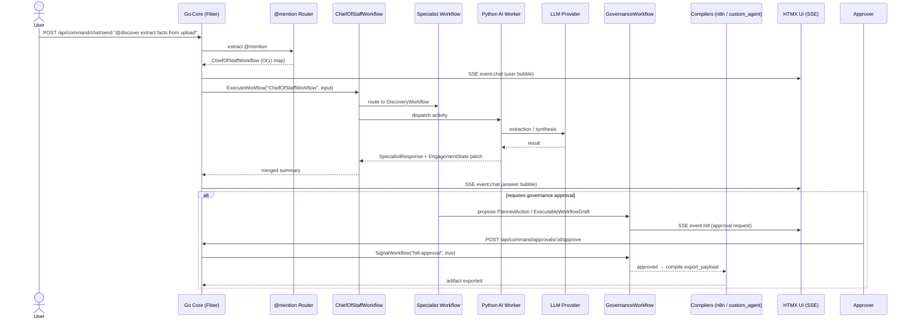
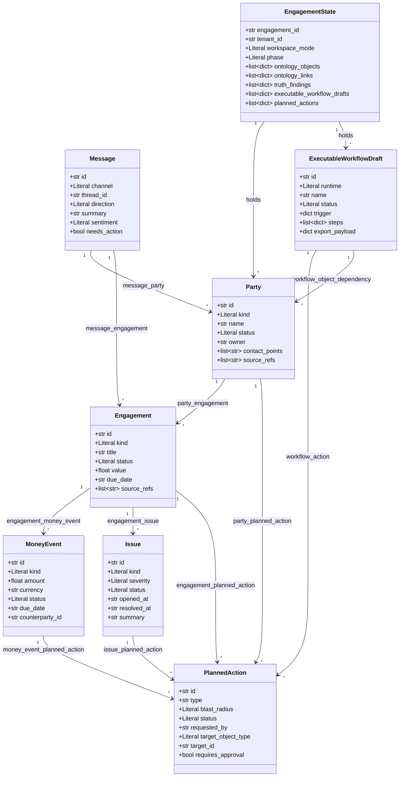

# OntologyAI Workspace

<p align="center">

</p> 


> 
>
> **An enterprise AI operations workspace.** OntologyAI Workspace turns messy business evidence into a shared business map, surfaces operational truth, and drafts governed workflow pilots for review and deployment planning. It is designed as a self-serve FDE companion and a multi-agent FDE operating system — not a small-business dashboard, generic chatbot, or no-code automation builder.

[](#getting-started)
[](#test-coverage)
[](https://go.dev)
[](https://www.python.org)
[](#v51-active-roster-vs-legacyv6-compatibility)

---

## Table of Contents

- [What changed](#what-changed)
- [Product position](#product-position)
- [Who it is for](#who-it-is-for)
- [Product pillars](#product-pillars)
- [User-facing workflow](#user-facing-workflow)
- [Core architecture](#core-architecture)
- [Why enterprise focus](#why-enterprise-focus)
- [UI language remaster](#ui-language-remaster)
- [Navigation](#navigation)
- [Current V5.1 scope](#current-v51-scope)
- [Build principle](#build-principle)
- [Architecture](#architecture)
- [Request / Response Flow](#request--response-flow)
- [Ontology Layer](#ontology-layer)
- [Project Structure](#project-structure)
- [Getting Started](#getting-started)
- [Architecture Decision Records](#architecture-decision-records)
- [V5.1 Active Roster vs Legacy/V6 Compatibility](#v51-active-roster-vs-legacyv6-compatibility)
- [Contributing & Conventions](#contributing--conventions)
- [Test Coverage](#test-coverage)

---

## What changed

This update shifts the product story away from small-business utility framing and toward enterprise operational complexity. The locked V5.1 product already defines OntologyAI as a shared workspace for discovery, ontology mapping, truth analysis, workflow design, governance, and deployment planning, so this README clarifies that the real value appears when organizations have fragmented systems, cross-functional processes, approval gates, and high-cost coordination problems.

## Product position

OntologyAI Workspace is best understood as an enterprise **ops twin** and guided pilot-building environment. The platform converts raw evidence from conversations, uploads, exports, and connected tools into typed operational objects, diagnoses what is stuck or risky, and generates governed workflow drafts plus handoff artifacts.

### One-line pitch

OntologyAI Workspace turns messy enterprise operations into a shared business map, reveals what is broken, and drafts governed workflows teams can review, approve, and pilot.

### What it is

- A self-serve FDE companion for enterprise discovery and pilot design.
- A shared workspace for evidence intake, ontology review, operational truth, approvals, and exports.
- An ontology-first AI operating layer with deterministic validation and governance controls.
- A portfolio-grade demonstration of the Forward Deployed Engineer method as software.

### What it is not

- A founder alert bot.
- A finance-only assistant.
- A passive dashboard.
- A generic no-code builder.
- An unconstrained autonomous action engine.
- A small-business utility bundle built around a few lightweight API add-ons.

## Who it is for

Primary users:
- Forward Deployed Engineers, implementation engineers, transformation leads, and enterprise operators running discovery-to-pilot engagements.
- Client-side operations owners using a workspace directly to structure messy business inputs and review proposed workflows.

Secondary users:
- Approvers, reviewers, domain contributors, and stakeholders consuming truth maps, workflow packs, SOPs, and governed action proposals.

## Product pillars

The product should be presented through three visible pillars rather than six backend workflow names.

### Understand

This pillar covers conversational discovery, evidence intake, the ontology setup flow, unresolved questions, and the first shared business map. It is powered internally by ChiefOfStaff, Discovery, and Ontology Mapping workflows, but the user experience should feel like one guided understanding loop.

### Diagnose

This pillar covers operational truth: blockers, contradictions, missing ownership, risky states, and action-worthy findings. Internally this maps to TruthAnalysisWorkflow, but the product surface should present it as operational diagnosis rather than abstract analytics.

### Build

This pillar covers workflow specs, SOPs, pilot drafts, approval gating, and exportable deployment packages. Internally this spans WorkflowBuilderWorkflow and GovernanceWorkflow, while the user sees a safe path from recommendation to review to pilot package.

## User-facing workflow

The internal architecture keeps the locked V5.1 phases, but the visible workflow should be simpler:

1. Frame the problem.
2. Add evidence.
3. Confirm the business map.
4. Review what is broken.
5. Approve the pilot draft.
6. Export or launch the pilot.

This aligns with the existing engagement phases of Discovery, Ontology Mapping, Truth Analysis, Workflow Design, Governance Review, Deployment Planning, and Handoff while making the experience easier to understand for enterprise users.

## Core architecture

The locked V5.1 architecture remains unchanged:
- Exactly 6 workflows: ChiefOfStaffWorkflow, DiscoveryWorkflow, OntologyMappingWorkflow, TruthAnalysisWorkflow, WorkflowBuilderWorkflow, GovernanceWorkflow.
- Exactly 6 ontology object types: Party, Engagement, MoneyEvent, Issue, Message, PlannedAction.
- Canonical EngagementState as the shared state for all workflow collaboration.
- ExecutableWorkflowDraft as the typed deployable workflow artifact.
- Governance exclusivity for external execution and approval-gated side effects.

## Why enterprise focus

OntologyAI shines when operations are too cross-functional, messy, and risky for simple automation glue. Small teams can often survive with a few point integrations, but larger organizations need a governed system that can unify evidence, preserve provenance, model relationships, identify contradictions, and route action through approvals instead of brittle one-off scripts.

This enterprise framing also better matches the product's ontology-first architecture, shared state design, governance model, handoff artifacts, and workflow-draft generation. Those capabilities are structurally more valuable in multi-team environments than in very small businesses with simple tool stacks.

## UI language remaster

Recommended user-facing labels:

| Internal term | User-facing label |
|---|---|
| ChiefOfStaff | Workspace Guide |
| Ontology | Business Map |
| Truth Analysis | Operational Truth |
| Workflow Builder | Pilot Builder |
| Governance | Approvals & Safety |
| ExecutableWorkflowDraft | Pilot Draft |

These labels keep the architecture intact while making the product more legible to enterprise users.

## Navigation

Recommended primary workspace navigation:
- Workspace
- Business Map
- Findings
- Workflow Drafts
- Approvals
- Exports

This is cleaner than exposing internal workflow names directly and still satisfies the required shared workspace views for chat, uploads, ontology, truth findings, workflows, drafts, approvals, and artifacts.

## Current V5.1 scope

V5.1 is an enterprise pilot workspace, not a full enterprise platform rollout. It includes:
- Shared workspace intake and streaming interaction.
- Guided ontology construction from evidence.
- Truth diagnosis over shared state.
- Workflow specs, SOPs, and executable workflow drafts.
- Approval-gated governance.
- Exportable truth maps, ontology snapshots, workflow packs, SOP packs, action registers, and executable draft artifacts.

It explicitly does not include full connector breadth or unconstrained autonomous execution.

## Build principle

Keep the backend contract strict and the frontend experience simple: typed state, deterministic validation, governed actions, and enterprise-grade review loops underneath; guided, comprehensible, outcome-first UX on top.

---

## Architecture

Users reach OntologyAI through a shared agentic workspace (web). The Go Core accepts the message, routes the `@mention` in O(1) to the `ChiefOfStaffWorkflow` control plane, which dispatches specialist Temporal workflows. A Python AI worker runs the LangGraph/DSPy agents against an LLM provider, streams answers back over SSE, and — for consequential writes — proposes a `PlannedAction` that `GovernanceWorkflow` approves. Approved `ExecutableWorkflowDraft`s are compiled deterministically (Windmill / n8n / ADK-Go / PydanticAI / smolagents) and exported behind the governance gate. **V6 BABOK** adds a `StrategyWorkflow` that produces 5 versioned BA artifacts from discovery + truth outputs, a `GovernanceGate` for pre-execution policy checks, and a `SolutionEvaluationReport` to close the evaluation loop.

**V5.1 Ontology Setup Wizard** adds a guided onboarding path: a 5-step HTMX wizard (Problem Framing → Evidence Intake → Candidate Review → Relationship Review → Approval) with dedicated Go handler and partials. The wizard is orchestration-only — it fires the existing DiscoveryWorkflow on completion rather than adding a new workflow type.

```mermaid
flowchart TD
    U["Founder / Client (2 modes: fde_assisted, client_self_serve)"] --> CORE["Go Core (Fiber HTTP + HTMX + SSE)"]
    U --> WIZARD["Ontology Setup Wizard <br/> <i>5-step HTMX (V5.1)</i>"]
    WIZARD --> CORE
    CORE --> ROUTER["@mention Router — O(1) map lookup → ChiefOfStaff control plane"]
    ROUTER --> COS["ChiefOfStaffWorkflow  (@ontologyai / @chief / @sarthi)"]
    COS --> DISC["DiscoveryWorkflow  (@discover)"]
    COS --> MAP["OntologyMappingWorkflow  (@map)"]
    COS --> TRUTH["TruthAnalysisWorkflow  (@truth)"]
    COS --> BUILD["WorkflowBuilderWorkflow  (@build)"]
    COS --> STRAT["StrategyWorkflow  (@strategy) <br/> <i>V6 BABOK</i>"]
    COS --> GOV["GovernanceWorkflow  (@govern)"]
    DISC --> PY["Python AI Worker (LangGraph / DSPy)"]
    MAP --> PY
    TRUTH --> PY
    STRAT --> PY
    BUILD --> PY
    GOV --> PY
    PY --> LLM["LLM Providers (Azure AI Foundry / Groq / Ollama / OpenAI)"]
    PY --> ONTO["Ontology Layer (adapter + governance + EngagementState)"]
    ONTO --> PG[("PostgreSQL (engagement_states)")]
    ONTO -->|"read-only bridge"| MS[("mission_states")]
    ONTO --> REDIS[("Redis")]
    ONTO --> QDRANT[("Qdrant")]
    ONTO --> GRAPH[("Neo4j + Graphiti)"]

    STRAT -->|"CurrentStateDescription"| ARTIFACTS["V6 BA Artifacts"]
    STRAT -->|"BusinessObjectives"| ARTIFACTS
    STRAT -->|"RiskAnalysisResults"| ARTIFACTS
    STRAT -->|"ChangeStrategy"| ARTIFACTS
    STRAT -->|"SolutionEvaluationReport"| ARTIFACTS

    BUILD -->|"ExecutableWorkflowDraft"| GOV
    GOV -->|"approved"| GATE["GovernanceGate <br/> <i>V6 BABOK</i>"]
    GATE -->|"check: approved + blast-radius + actor"| COMP["Deterministic Compilers <br/> (Windmill / n8n / ADK-Go / PydanticAI / smolagents)"]
    COMP -->|"export_payload"| EXPORT["Artifact Exports (governance-gated)"]
    GOV -->|"audit + observability"| OBS["Langfuse / Audit Logs"]

    subgraph OWNED["OntologyAI-owned (built, not bought)"]
        CANVAS["OntologyAI Workflow Canvas (simplified n8n-like node editor)"]
        MODEL["Canonical Model: ExecutableWorkflowDraft (12-node vocabulary)"]
        WS["Shared Client + FDE Workspace (chat, transcript, evidence, governance)"]
    end
    CANVAS --> MODEL
    WS --> CANVAS

    subgraph RUNTIME["Runtime Targets (execution only)"]
        WM["Windmill <br/> <i>primary (ADR-009)</i>"]
        N8N["n8n <br/> <i>legacy compat</i>"]
        ADK["ADK-Go"]
        PA["PydanticAI"]
        SA["smolagents"]
    end
    COMP -->|"Windmill script/flow"| WM
    COMP -->|"n8n JSON"| N8N
    COMP -->|"main.go / tools.go"| ADK
    COMP -->|"agent.py"| PA
    COMP -->|"worker.py"| SA
    WM -.->|"run state / errors (read-only)"| WS
    N8N -.->|"run state / errors (read-only)"| WS
    PA -.->|"run state (read-only)"| WS
```

**Key components**

| Layer | Responsibility |
|-------|----------------|
| **Interface** (`apps/core/` HTMX) | Web workspace, chat, uploads, approval UI, exports UI (11 screens). |
| **OntologyAI Workflow Canvas** (owned) | Simplified n8n-like node editor; every edit persisted to `ExecutableWorkflowDraft`. Native n8n editor is **not** exposed to clients (OEM/Embed license). |
| **Canonical model** (owned) | `ExecutableWorkflowDraft` + 12-node vocabulary — the AI-authored, governed, versioned source of truth. |
| **Go Core** (`apps/core/`) | Fiber HTTP server, HTMX templates, SSE streaming, `@mention` routing, Temporal client. |
| **Control plane** | `ChiefOfStaffWorkflow` — intent classify, route, deterministically merge `EngagementState` patches, summarize. |
| **Specialist workflow layer** | 5 V5.1 canonical + ChiefOfStaff control plane (= 6 total). V6 StrategyWorkflow gated behind `ENABLE_V6_WORKFLOWS=on`. |
| **Python AI Worker** (`apps/ai/`) | LangGraph/DSPy agents per domain; builds the Ontology; proposes governed writes; compiles drafts. Backbone = Temporal + typed Python; ADK optional; smolagents sandboxed-only. Compilers: `RuntimeCompiler` ABC + 4 targets (n8n, ADK-Go, PydanticAI, smolagents). |
| **LLM providers** | OpenAI-compatible SDK → Azure AI Foundry, Groq, Ollama, OpenAI (auto-detected). |
| **Data & memory** | PostgreSQL (`engagement_states`), Redis, Qdrant, Neo4j + Graphiti. |
| **BABOK Strategy (V6)** | `StrategyWorkflow` produces 5 versioned BA artifacts from truth findings + operator goal. Artifacts are immutable after approval; `GovernanceGate` checks approval, blast-radius, and authorization before execution. `SolutionEvaluationReport` closes the evaluation loop. |
| **Runtime / export** | 5 deterministic compilers (`windmill`, `n8n`, `adk_go`, `pydantic_ai`, `python_agent`) behind a `RuntimeCompiler` ABC + `get_compiler()` factory, all gated by `GovernanceWorkflow` + `GovernanceGate`. **Windmill** (ADR-009) is the primary target; n8n is legacy backward compat. |
| **Observability** | Langfuse tracing, audit logs, approval history. |

---

## Request / Response Flow

A typical `@mention` query — from the user's message to a streamed answer, with the specialist → governance approval → deterministic export branch:



The dispatch runs in a goroutine with a 5-minute context timeout and a non-blocking `tryBroadcast()` (`select { case ch <- msg: default: log }`) so the UI shows a "🤔 Thinking…" bubble immediately and never blocks the HTTP handler.

---

## Ontology Layer

The V5.1 Ontology is the **canonical shared model** of a business engagement. It is fully typed (Pydantic v2, `extra="forbid"`, `strict=True`) and TDD-verified. It comprises 6 primary Object Types, the `ExecutableWorkflowDraft` and `EngagementState` shared-state shapes, and 11 semantic link types.

| Component | File | What it does |
|-----------|------|--------------|
| **Object Types** | `apps/ai/src/ontology/object_types.py` | 6 strict Pydantic v2 models: `Party`, `Engagement`, `MoneyEvent`, `Issue`, `Message`, `PlannedAction`. |
| **Link Types** | `apps/ai/src/ontology/link_types.py` | `LINK_TYPES` registry of 11 semantic links + `resolve_link()`. |
| **Action Types** | `apps/ai/src/ontology/action_types.py` | Full `PlannedAction` model + action registry. |
| **Workflow Drafts** | `apps/ai/src/ontology/workflow_drafts.py` | `ExecutableWorkflowDraft` — single source of truth; `export_payload` only set by compiler; `status="activated"` only by Governance. |
| **Engagement State** | `apps/ai/src/schemas/engagement_state.py` | `EngagementState` canonical shared state (mode, phase, ontology objects/links, truth findings, drafts, actions). |
| **Governed Writes** | `apps/ai/src/ontology/governance.py` | `@governed_write` decorator enforcing the `OBJECT_WRITE_POLICY` blast-radius gate; only `GovernanceWorkflow` finalizes external execution. |

### Object Types, Links & Shared State



> **Canonical ontology types (6):** The V5.1 product contract specifies exactly 6 canonical ontology object types: Party, Engagement, MoneyEvent, Issue, Message, PlannedAction. These are the entity types that the OntologyAI core populates, links, and reasons over.
>
> **UI view-model categories (V6 BABOK):** Artifact, Decision, and Metric are V6 BABOK view-model categories used in the StrategyWorkflow UI and artifact system. They are **NOT** V5.1 canonical ontology types and are never populated or linked by the V5.1 Discovery/OntologyMapping pipelines. They appear only in the StrategyWorkflow (V6) context.

### `@governed_write`

The `@governed_write` decorator enforces human-in-the-loop approval for consequential ontology writes. Two independent gates trigger a required `PlannedAction`:

1. **Explicit flag** — the property is `requires_approval=True` in `OBJECT_WRITE_POLICY`.
2. **Blast-radius threshold** — the effective blast radius is at/above the configured threshold (default `"medium"`; `"low"` writes proceed).

When a `PlannedAction` is required, the decorator **blocks** the underlying write and returns the `PlannedAction` for the caller to submit for approval. Only `GovernanceWorkflow` may set `status=activated`, `executing`, `completed`, or `exported` on external side effects.

```python
@governed_write(object_type="Party", property_name="status", requested_by="Discovery")
def governed_party_update(party_id: str, **kwargs): ...
```

---

## Project Structure

```
apps/
  core/                     # Go Modular Monolith (control / gateway)
    cmd/
      server/               # HTTP server entrypoint
      worker/               # Temporal worker entrypoint
    internal/
      web/                  # HTTP handlers (Fiber + HTMX + SSE)
        handler.go          # All endpoints, @mention routing (O(1) map → 17 aliases / 6 V5.1 + 1 gated V6)
        sse.go              # SSE handler (SetBodyStreamWriter + SSEHub)
        command_center_test.go
        templates/
          command_center.html
          partials/         # HTMX partials (11 workspace screens + 6 ontology wizard partials)
            ontology_setup_start.html
            ontology_setup_problem_framing.html
            ontology_setup_evidence_intake.html
            ontology_setup_candidate_review.html
            ontology_setup_relationship_review.html
            ontology_setup_approval.html
        ontology_setup_handler.go  # 5-step HTMX wizard endpoints (V5.1)
        ontology_setup_test.go     # 17 wizard handler tests
      agents/               # Go agent definitions
      config/               # LLM configuration
      db/                   # sqlc generated code
      database/             # Connection utilities
      temporal/             # Temporal client (SignalWorkflow, ExecuteWorkflow)
      workflow/             # Temporal workflows & stubs
    sqlc.yaml               # sqlc configuration
  ai/                       # Python AI Worker
    src/
      ontology/             # V5.1 — Object Types, Link Types, Action Types, Workflow Drafts, Governance
        object_types.py     # 6 canonical types
        link_types.py       # 11 link types
        action_types.py     # PlannedAction + registry
        workflow_drafts.py  # ExecutableWorkflowDraft (source of truth)
        adapter.py          # mission_state_to_ontology (read-only bridge)
        governance.py       # @governed_write + OBJECT_WRITE_POLICY
      schemas/              # Pydantic models (engagement_state, specialist_response, workflow_spec, sop, executable_workflow_draft)
        ontology_setup_state.py # OntologySetupState + SetupStep enum + step data models (V5.1 — 28 state model tests)
      schemas/              # Pydantic models + V6 BABOK artifacts
        ba_artifact.py          # BaseArtifact + ArtifactLifecycleStatus (V6)
        strategy_artifacts.py   # 5 BABOK artifacts: CurrentStateDescription, BusinessObjectives, RiskAnalysisResults, ChangeStrategy, SolutionEvaluationReport (V6)
        governance_gate.py      # GovernanceGate — approval + blast-radius + actor checks (V6)
      workflows/            # Temporal workflow definitions (+ V6 StrategyWorkflow)
        chief_of_staff_workflow.py   # @workflow.defn(name="ChiefOfStaffWorkflow")
        discovery_workflow.py        # @workflow.defn(name="DiscoveryWorkflow")
        ontology_mapping_workflow.py # @workflow.defn(name="OntologyMappingWorkflow")
        truth_analysis_workflow.py   # @workflow.defn(name="TruthAnalysisWorkflow")
        workflow_builder_workflow.py # @workflow.defn(name="WorkflowBuilderWorkflow")
        governance_workflow.py       # @workflow.defn(name="GovernanceWorkflow")
        strategy_workflow.py         # @workflow.defn(name="StrategyWorkflow") (V6)
      runtime/              # Deterministic compilers (5 targets) + artifact export
        base.py                 # RuntimeCompiler ABC
        windmill_compiler.py    # Windmill script/flow compiler (primary, ADR-009)
        windmill_client.py      # Windmill REST API client
        n8n_compiler.py         # n8n JSON compiler (legacy compat)
        n8n.py                  # N8NCompiler wrapper class
        n8n_client.py           # n8n REST API client
        adk_go_compiler.py      # ADK-Go: generates main.go + tools.go
        pydantic_ai_compiler.py # PydanticAI: generates agent.py w/ BaseModel
        python_agent_compiler.py# smolagents: generates CodeAgent worker.py
        custom_agent_compiler.py# Legacy agent config compiler
        deployers.py            # Deployer functions (windmill, n8n, custom_agent)
        artifact_export.py      # Artifact export service
      session/              # EngagementState store (canonical) + mission_state read bridge
      memory/               # Graphiti, Qdrant, spine
      integrations/         # Stripe, Plaid, Slack, ERPNext, HubSpot, QuickBooks
      services/             # Trust battery, alert gate
        engagement_state_store.py # Async PostgreSQL CRUD (asyncpg) for EngagementState (V5.1)
      activities/           # Temporal activity definitions
        compile_windmill_workflow.py  # Compiles + deploys ExecutableWorkflowDraft to Windmill (V5.1)
      worker.py             # Registers all 18 workflows (6 V5.1 + 4 V6 + 8 legacy V4.1) + activities
    tests/                  # Pytest suite (1286 passing / 32 skipped + V5.1 suites)
    pyproject.toml          # Python dependencies
```

---

## Getting Started

### Prerequisites

- **Docker** (Temporal, Qdrant, PostgreSQL, Neo4j)
- **Go 1.24**
- **Python 3.13** with [`uv`](https://github.com/astral-sh/uv)

### Quickstart

```bash
# 1. Start infrastructure (Temporal, Qdrant, PostgreSQL, Neo4j)
make up

# 2. Run the Go server (HTTP + HTMX + SSE workspace)
cd apps/core && go run cmd/server/main.go

# 3. Run the Go Temporal worker (in a second terminal)
cd apps/core && go run cmd/worker/main.go

# 4. Install Python deps and run the Python Temporal worker (third terminal)
cd apps/ai && uv sync
cd apps/ai && uv run python -m src.worker

# 5. Open the workspace
#    http://localhost:8080/command
#    Type "@discover Extract the key facts from this upload" → see "🤔 Thinking..." → see the answer
```

### Run the tests

```bash
# Go — all packages
cd apps/core && go test ./...

# Go — web handlers only
cd apps/core && go test ./internal/web/... -v

# Python — full suite (1286 passing / 32 skipped + V5.1 schema/workflow/compiler/governance/export + multi-runtime suites)
cd apps/ai && uv run pytest tests/ -v

# Python — ontology TDD suites
cd apps/ai && uv run pytest tests/test_ontology_schema.py tests/test_link_and_action_registry.py tests/test_engagement_state.py tests/test_executable_workflow_draft.py -v
```

### Environment variables (LLM providers + legacy modules)

The system uses the official OpenAI-compatible SDK, auto-detecting the configured provider:

| Provider | Variables |
|----------|-----------|
| **Azure AI Foundry** | `AZURE_OPENAI_ENDPOINT`, `AZURE_OPENAI_API_KEY` |
| **Groq** | `GROQ_API_KEY` |
| **OpenAI** | `OPENAI_API_KEY` |
| **Ollama** (local) | `OLLAMA_BASE_URL`, `OLLAMA_API_KEY` |

| Control | Variable | Default |
|---------|----------|---------|
| Temporal task queue | `ONTOLOGYAI-MAIN-QUEUE` (fallback `TRACKGUARD-MAIN-QUEUE`) | `TRACKGUARD-MAIN-QUEUE` |
| Legacy FDE modules | `LEGACY_FDE_MODULES=on` | off (gated) |

Secrets live in a local `.env` file (never committed). See `internal/config/llm.go` for auto-detection logic.

---

## Architecture Decision Records

These ADRs capture the load-bearing architectural decisions. Each follows an RFC 2119-style **Status / Context / Decision / Consequences** structure.

### ADR-001: Rebrand TrackGuard / Sarthi → OntologyAI

- **Status:** Accepted
- **Context:** The product was known as *TrackGuard* / *Sarthi*. As the scope expanded from alert-tracking to a full business Ontology with governed specialist agents, the old name no longer reflected the product. A rebrand risked breaking existing deployments, chat aliases, migration filenames, and Docker/container names that external tooling depended on.
- **Decision:** Rebrand the product to **OntologyAI** across all user-facing surfaces (page titles, display names, documentation). To preserve compatibility we **MUST** keep:
  - the `@sarthi` chat alias (and `@agent`, `@qa`, `@ask`) routing to `ChiefOfStaffWorkflow`;
  - SQL migration filenames and Docker service/container names (e.g. `iterateswarm-api`);
  - the Temporal task queue constant `TRACKGUARD-MAIN-QUEUE` (now the fallback default for `ONTOLOGYAI-MAIN-QUEUE`).
  Internal Pydantic `Sarthi*` types were fully renamed to `OntologyAI*` with zero dangling references.
- **Consequences:**
  - *Positive:* A name that matches the product's actual scope; clean, consistent branding for newcomers.
  - *Negative:* Two names coexist in the codebase (product = OntologyAI; some infra identifiers retain the legacy name), which must be documented to avoid confusion (see [V5.1 Active Roster vs Legacy/V6 Compatibility](#v51-active-roster-vs-legacyv6-compatibility)).

### ADR-002: Six frozen canonical workflows with O(1) `@mention` map routing

- **Status:** Accepted
- **Context:** V4.2 froze a 5-specialist roster (`ChiefOfStaffWorkflow`, `FPAWorkflow`, `GrowthAnalyticsWorkflow`, `ReliabilityWorkflow`, `CommsWorkflow`) with O(1) map routing. V5.1 reframes the product as a self-serve FDE companion + multi-agent FDE operating system, replacing the domain-specialist roster with a discovery-to-deployment workflow roster.
- **Decision:** Freeze **six** canonical workflows — `ChiefOfStaffWorkflow` (control-plane orchestrator), `DiscoveryWorkflow`, `OntologyMappingWorkflow`, `TruthAnalysisWorkflow`, `WorkflowBuilderWorkflow`, `GovernanceWorkflow` — and keep the declarative `map[string]specialistRoute` providing O(1) lookup. The control-plane alias set (`@ontologyai`, `@agent`, `@ask`, `@chief`, `@sarthi`) routes to `ChiefOfStaffWorkflow`; specialist aliases (`@discover`, `@map`, `@truth`, `@build`, `@govern`) route to the five specialists. Adding a workflow is now **one map entry + one Python workflow class**; no handler changes.
- **Consequences:**
  - *Positive:* O(1) routing; new workflows are data-driven; the roster is stable and documented; the control plane cleanly separates orchestration from domain work.
  - *Negative:* Workflow type strings are not compile-time checked — a typo fails at runtime. Mitigated by a test that verifies every route's workflow name matches a registered Temporal workflow.

### ADR-003: Governance exclusivity — only `GovernanceWorkflow` finalizes external execution

- **Status:** Accepted
- **Context:** Specialists can propose writes with real-world impact (change money state, send a message, activate a workflow). Unbounded autonomous writes are unsafe for a founder/client-facing product. V4.2 introduced `@governed_write` routing consequential mutations through a `PlannedAction`; V5.1 extends this so that *no* workflow except `GovernanceWorkflow` may set `status=activated`, `executing`, `completed`, or `exported` on external side effects.
- **Decision:** Keep `@governed_write` plus an `OBJECT_WRITE_POLICY` registry. A write is blocked and routed through a `PlannedAction` (requiring human approval) when either (a) the property is `requires_approval=True`, or (b) its effective blast radius is at/above a configurable threshold (default `"medium"`; `"low"` writes proceed). Additionally, `GovernanceWorkflow` is the sole executor of final external side effects; `ExecutableWorkflowDraft.status="activated"` may only be set by `GovernanceWorkflow`. The decorator mirrors the Temporal HITL pattern: it returns the `PlannedAction` and intentionally does **not** execute the underlying write.
- **Consequences:**
  - *Positive:* Consequential writes are never silent; a single, overridable policy source governs blast radius; governance is the single gate before any side effect; the contract is unit-testable in isolation.
  - *Negative:* Every governed write adds a round-trip (propose → approve → execute); the policy source must be kept in sync with the actual specialist actions.

### ADR-004: Deterministic compiler / export purity rule

- **Status:** Accepted
- **Context:** V5.1 must generate deployable `ExecutableWorkflowDraft` artifacts for n8n and custom-agent runtimes. Letting the LLM freehand the export payload risks malformed, unvalidated, or unsafe automation. The thin-LLM / fat-deterministic-core principle forbids the LLM from generating export payloads directly.
- **Decision:** All compilers (n8n, ADK-Go, PydanticAI, smolagents) are **pure, deterministic functions** extending a `RuntimeCompiler` ABC with a `compile(draft: dict) -> dict` contract. The LLM may propose workflow *structure* (steps, decision points, approvals) but **must never write `export_payload`**. `export_payload` is only populated by the compiler code; this is enforced by a model validator in `workflow_drafts.py` and asserted in `test_runtime_compilers.py` / `test_n8n_compiler.py`.
- **Consequences:**
  - *Positive:* Byte-stable, validated, inspectable exports; the LLM is kept in its safe lane (ambiguity, synthesis, narrative); exports are reproducible and testable.
  - *Negative:* Compiler logic must be maintained for each runtime target; structure proposed by the LLM must be normalized by the compiler before export.

### ADR-005: `EngagementState` as canonical shared state (with `mission_states` read-only bridge)

- **Status:** Accepted
- **Context:** V4.2 used `MissionState` as the operational state store. V5.1 needs a richer, phase-aware shared state (`EngagementState`) covering discovery notes, ontology objects/links, truth findings, workflow specs, executable drafts, and planned actions — with `workspace_mode` and `phase` as first-class fields. Deleting `mission_states` outright would break the existing read path and downstream consumers.
- **Decision:** Make `EngagementState` the **canonical write target** (persisted in `engagement_states`). Keep `mission_states` as a **read-only bridge for one version**; `mission_state_to_ontology` remains callable until the adapter is fully migrated to `MoneyEvent`. All specialist workflows read `EngagementState` first and write back a typed, deterministically-merged patch; unknown keys are rejected and merge conflicts log + preserve provenance. `workspace_mode` is immutable after creation unless explicitly migrated.
- **Consequences:**
  - *Positive:* One shared, typed source of truth; no agent owns a private model of the business; clean migration path without breaking existing infra.
  - *Negative:* Two state shapes coexist for one version; the bridge adds a small maintenance burden until `mission_states` is retired.

### ADR-006: SSE + HTMX `SetBodyStreamWriter` for streaming chat

- **Status:** Accepted
- **Context:** The original client used raw JavaScript `EventSource` with client-side DOM construction for every chat bubble — duplicating template logic and adding ~40 lines of reconnect/parse JS. Synchronous `run.Get()` in the HTTP handler also blocked responses for up to 60s.
- **Decision:** Stream chat over Server-Sent Events using Fiber's `SetBodyStreamWriter` with a `*bufio.Writer`, and let HTMX's `hx-ext="sse"` manage the connection lifecycle declaratively (`sse-connect` / `sse-swap` / `hx-swap`). The server renders chat bubbles as HTML fragments (`renderChatBubble()`) and pushes them as named SSE events (`event: chat`); all user/LLM text is `html.EscapeString()`-escaped. An `SSEHub` provides event-type-filtered, per-subscriber fan-out (buffered 64).
- **Consequences:**
  - *Positive:* ~40 fewer lines of JS; auto-reconnect built in; single source of truth for HTML; XSS-safe; immediate "Thinking…" feedback via non-blocking `tryBroadcast()`.
   - *Negative:* HTML fragments over SSE inflate bandwidth vs JSON; harder to integrate non-HTMX clients; error handling moves into goroutine closures (log-based monitoring required).

### ADR-007: Reuse n8n as the invisible execution runtime; build the OntologyAI canvas on the canonical model

- **Status:** Accepted (locked V5.1, PR #33, branch `feature/ontologyai-v5.1`)
- **Context:** V5.1 already ships the canonical `ExecutableWorkflowDraft` model, deterministic compilers (`runtime/n8n_compiler.py`, `runtime/custom_agent_compiler.py`, `runtime/artifact_export.py`), 6 active workflows, and `EngagementState` with deterministic `merge_patch`. The open question was whether to build a workflow engine/canvas from scratch or reuse an existing one. Building from scratch would duplicate mature execution/integration/retry/scheduling/credential tooling and slow "finishing the product."
- **Decision:** **Do NOT build the workflow engine or canvas from scratch.** Reuse **n8n** as the execution/runtime layer, but build **OntologyAI's own client-facing AI workspace and live workflow canvas** on top of the canonical `ExecutableWorkflowDraft` model. The final split:

  | Layer | Decision | Why |
  |-------|----------|-----|
  | Client experience | Build your own | Differentiation: conversation, transcript extraction, evidence, AI suggestions, FDE collaboration, governance, pilot creation |
  | Workflow data model | Build your own typed canonical model | Lets the AI generate/validate/explain/version/govern workflows deterministically |
  | Execution runtime | Reuse n8n first | n8n provides execution, integrations, retries, scheduling, credentials, ops tooling |
  | Agent orchestration | Keep existing Temporal/Python | 6 workflow roles, typed shared state, governance, deterministic compilers already exist |
  | Agent framework | Use one, not two | Do not add ADK merely because fashionable; smolagents only sandboxed utility |

  **Licensing constraint:** the native n8n editor is **NOT** exposed to clients in the first release (n8n OEM/Embed license required). The OntologyAI canvas *looks and behaves like* a simplified n8n canvas; every edit is saved into `ExecutableWorkflowDraft`; approved drafts compile to n8n JSON and deploy to the client's own n8n instance or a managed n8n runtime only after the appropriate commercial agreement. Run state, errors, and activation status are reflected back into OntologyAI read-only.

  **Stack ownership:** OntologyAI owns the workspace, ingestion, evidence, ontology/truth generation, canvas, governance UI, versioning, and the compile/export button. n8n owns execution, connectors, scheduling/retries, and credential handling on the client instance. Python owns extraction, retrieval, validation, deterministic compilation, policy/approval gates, agent coordination, and audit trail.

  **Multi-runtime compilers (ADR-008):** Four deterministic compilers now exist behind a `RuntimeCompiler` ABC: n8n (automation), ADK-Go (Go-native agents), PydanticAI (typed Python agents), and smolagents/python_agent (sandboxed utility). Runtime selection is deterministic based on workflow traits. See [`ADR-008`](#adr-008-multi-runtime-compiler-architecture).

  **ADK vs smolagents:** Temporal + typed Python = backbone; ADK = optional orchestration enhancement only (not added merely because fashionable); smolagents = sandboxed utility worker (document exploration, safe data transforms, connector research, isolated code analysis) — agent-generated code must NOT access production network, credentials, database, or the n8n instance.

  **Canonical node vocabulary (12 nodes):** Trigger, Human input/form, AI extraction or classification, Condition/branch, HTTP/API action, Send message, Create/update record, Approval gate, Delay/schedule, Transform data, Error/fallback, End/success metric. These map to n8n during compilation; new integrations/bespoke nodes come later.
- **Consequences:**
  - *Positive:* No duplicated execution engine; fast path to a finished product; clear differentiation in the client experience; deterministic, governed, versioned workflow authoring; n8n's ops tooling reused for free.
   - *Negative:* A license boundary must be respected (no exposed n8n editor in first release); the OntologyAI canvas must stay in sync with `ExecutableWorkflowDraft`; deployment to a managed n8n runtime is gated on a commercial agreement.

### ADR-008: Multi-Runtime Compiler Architecture

- **Status:** Accepted
- **Context:** V5.1 originally shipped two deterministic compilers (`n8n`, `custom_agent`). As three agent-runtime patterns emerged (typed Python, Go-native, sandboxed utility), a single monolith compiler became untenable. The product director confirmed LangGraph + OntologyAI stays the single control plane.
- **Decision:** Create a `RuntimeCompiler` ABC with a `get_compiler()` factory. Four deterministic compilers each produce a runtime-specific artifact from the canonical `ExecutableWorkflowDraft`: n8n (JSON), ADK-Go (Go source), PydanticAI (Python agent), smolagents (sandboxed worker). Runtime selection is deterministic based on workflow traits.
- **Consequences:**
  - *Positive:* Each compiler is isolated, testable, and swappable without changing the product brain.
  - *Positive:* 15 TDD tests cover all 4 targets + ABC + factory — byte-stable, reproducible exports.
  - *Negative:* Each new runtime target requires a new compiler module; generated code must be reviewed by client teams.

### ADR-009: Windmill replaces n8n as primary execution runtime

- **Status:** Accepted (transitional — see V5.1 spec note below)
- **Context:** n8n served as the execution runtime throughout V5.1 development. As the product scaled, Windmill emerged as a better fit: natively supports Python/TypeScript scripts, has a built-in approval/suspend module, supports secret management, webhooks, schedules, and is open-source with a permissive AGPL license. Windmill's script/flow model maps directly to `ExecutableWorkflowDraft` without an intermediate compilation step (scripts are first-class).
- **Decision:** Replace n8n with **Windmill** as the canonical execution target (ADR-009). n8n is preserved as legacy backward compat but is no longer the primary target. Windmill runs on port 8000 with a dedicated worker container.
- **Consequences:**
  - *Positive:* Native script/flow support, built-in approvals, secrets, webhooks, AGPL license.
  - *Negative:* Windmill Docker image must be pulled and configured; `WINDMILL_TOKEN` must be set in `.env`.

> **V5.1 spec note:** The locked V5.1 PRD specifies n8n + custom_agent as the canonical deterministic runtime compilers. Windmill (ADR-009) was introduced post-V5.1 as a better execution-runtime fit (native Python/TypeScript scripts, built-in approvals, AGPL license) but is documented here as transitional architecture. It is not part of the locked V5.1 product contract and should be considered a V5.2 or V6 capability. For strict V5.1 deployments, n8n remains the canonical target.

### V5.1/V6 Runtime: Windmill (primary) + n8n (legacy compat)

Windmill runs as the primary execution runtime with its REST API exposed on port `8000`:

```
http://windmill:8000/api
```

n8n is preserved for backward compatibility on the internal `iterateswarm-net` network:

```
http://n8n:5678/api/v1
```

- Windmill credentials: `WINDMILL_URL`, `WINDMILL_TOKEN`, `WINDMILL_WORKER_TOKEN` in `.env`.
- n8n credentials: `N8N_API_KEY` (legacy, will be deprecated).
- The OntologyAI canvas is the only client-facing surface; Windmill/n8n editors are never exposed.

---

## V5.1 Active Roster vs Legacy/V6 Compatibility

The default active V5.1 Temporal worker registers exactly **6 canonical workflows**:

| # | Workflow | Role | Category |
|---|----------|------|----------|
| 1 | `ChiefOfStaffWorkflow` | Control-plane orchestrator | V5.1 canonical |
| 2 | `DiscoveryWorkflow` | Evidence intake & fact extraction | V5.1 canonical |
| 3 | `OntologyMappingWorkflow` | Object/link type population | V5.1 canonical |
| 4 | `TruthAnalysisWorkflow` | Cross-source truth diagnosis | V5.1 canonical |
| 5 | `WorkflowBuilderWorkflow` | Executable workflow draft generation | V5.1 canonical |
| 6 | `GovernanceWorkflow` | Approval gate & external execution finalization | V5.1 canonical |

**V6 `StrategyWorkflow`** — gated behind `ENABLE_V6_WORKFLOWS=on`. Default: off.
**Legacy V4.1 workflows** (Pulse, Investor, FPA, GrowthAnalytics, etc.) — gated behind `LEGACY_FDE_MODULES=on`. Default: off.

When `ENABLE_V6_WORKFLOWS=on` is set:
- `StrategyWorkflow` is added to the active Temporal worker
- `@strategy` alias is added to the route map (7 total aliases)

When `LEGACY_FDE_MODULES=on` is set:
- All 11 legacy V4.1 workflows are added alongside the active roster

---

## Contributing & Conventions

- **Feature branches:** `git checkout -b feature/description` — never commit directly to `main`.
- **Conventional Commits:** `feat:`, `fix:`, `refactor:`, `docs:`, `test:`, `chore:`.
- **Never commit to `main`.** Open a PR from your feature branch.
- **Secrets:** use a local `.env` file; never commit secrets.
- **Agent guidelines:** full coding standards, build/test commands, and the specialist route-map pattern live in [`AGENTS.md`](./AGENTS.md) at the repo root.
- **Database:** use `sqlc` for type-safe SQL; regenerate generated code after schema changes.

---

## Test Coverage

| Suite | Tests | Status |
|-------|-------|--------|
| Python Unit Tests | 1286 passing / 32 skipped (baseline + V6 BABOK + V5.1 wizard/infra suites) | ✅ |
| V5.1 Schema & State | object_types, link_types, action_types, engagement_state, specialist_response, workflow_spec, sop, executable_workflow_draft | ✅ |
| V5.1 Workflows (6 workflows) | Discovery, Ontology Mapping, Truth Analysis, Workflow Builder, Governance + workflow_names | ✅ |
| V5.1 Multi-Runtime Compilers | Windmill (24 tests), n8n, ADK-Go, PydanticAI, smolagents + ABC + factory | ✅ |
| V5.1 Compilers / Export / Deployers | Windmill, n8n, custom_agent compile + deploy tests | ✅ |
| V5.1 Governance / HITL | Governance workflow (17 tests), HITL signals | ✅ |
| **V5.1 Ontology Setup Wizard** | Setup state models (28 tests), Go handler (17 tests), ChiefOfStaff wizard routing (52 tests) — **97 total** | ✅ |
| **V5.1 Infra & Registration** | Worker registration (5 tests), Windmill compile activity (7 tests), EngagementStateStore (8 tests), strategy name fix | ✅ |
| **V6 BABOK Artifacts** | BA artifact base (9 tests), strategy artifacts (9 tests), governance gate (12 tests), merge_patch protection (4 tests), strategy workflow + evaluation (4 tests) — **24 + 14 = 38 total** | ✅ |
| V6 ChiefOfStaff routing | `@strategy` alias, strategy intent classification, strategy route — integration tested | ✅ |
| Go HTMX Web Handlers + Wizard | Route map (17 aliases), command center panels, ontology setup wizard (17 tests) | ✅ |
| Go Build | Clean | ✅ Binary compiles |
| E2E Smoke Test | 9/9 | ✅ Real Docker + real LLM |
| Windmill E2E | 4 pass + 4 skip (graceful when Windmill container not running) | ✅ |
| DB Tests | — | 🟡 Skip (requires PostgreSQL container) |
